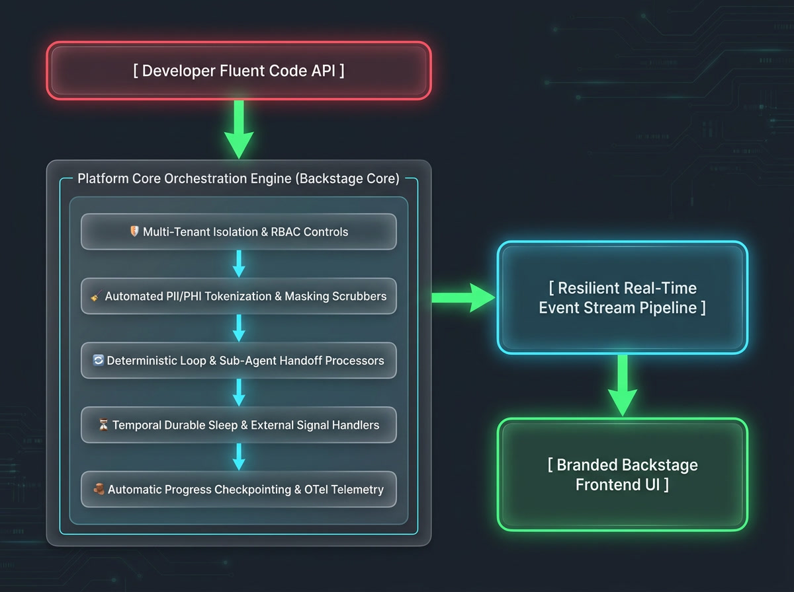

# AI Crew Suite Fluent Graph Builder

Introduction: The Fluent Workflow Builder

The **Agentic Workflow Framework** provides a type-safe, developer-centric Domain Specific Language (DSL) for designing robust, deterministic multi-agent applications inside the **Spotify Backstage IDP** ecosystem.

Traditionally, developing complex agentic frameworks requires managing mathematical Directed Acyclic Graphs (DAGs), manual execution tracking, transient node crashes, and arbitrary event logs. This framework replaces that architectural noise with **Business-Logic Primitives**: an expressive, sequential pipeline built entirely on **Steps, Choices, Loops, and Multi-Agent Delegations**.



## 💡 Core Design Philosophy

The framework bridges high-level generative AI orchestration with low-level enterprise infrastructure by enforcing four immutable pillars:

- **Immutable State Reduction (The Monadic Principle):** Heavily inspired by the **State Monad** in functional programming and standard Redux store architectures, state objects within this runtime are strictly **Read-Only** (`Readonly<TState>`). Step handlers cannot directly mutate state via side effects. Instead, they execute calculations and return a clean, type-safe *State Delta Dictionary* (`Partial<TState>`). The core engine collects these deltas, applying structural merges to compute a deterministic, tamper-proof audit timeline.
- **Zero-Overhead End-to-End Type Safety:** By instantiating a workflow using standard **Zod schemas** (`stateSchema` and `inputSchema`), typing intelligence automatically propagates down the entire fluent chain. Every step, loop condition, parallel fan-out track, and routing choice implicitly recognizes the exact shape of your application's input and memory layout. The compiler will instantly flag typo mismatches (`{ scoree: baseScore }`) at design time, shielding developers from runtime failures.
- **Platform-Enforced Safety Sandboxing:** Third-party developer plugins consume a curried `AgentContext` (`ctx`) that acts as an enterprise facade. Behind the scenes, the framework seamlessly intercepts operations to inject **Temporal durable execution limits**, **OpenTelemetry trace metrics tracking**, **Backstage RBAC compliance policies**, and **automated PII/PHI tokenization proxies** before prompts ever hit external LLMs.
- **Compile-Time & Design-Time Topology Verification:** By declaring the pipeline explicitly upfront, the framework knows the structure of the agent before a single step executes. The system features a built-in **Topological Depth-First Search (DFS) validation pass** at boot time. If a developer accidentally points a routing choice to an undeclared step or creates an unhandled cyclic dead end, the engine throws a descriptive build failure in your development environment, accompanied by real-time IDE linting hints.

## `.addStep(name, handler, options?)`

The `.addStep()` method is the fundamental block of your agentic workflow. It appends an ordered processing node to the sequential execution pipeline.

Instead of dealing with graph tracking code or manual state manipulation, steps function like **Redux reducers**. They receive an immutable snapshot of the current state, run async business logic, and return a clean *state delta* (`Partial<TState>`) that the core engine reduces into historical memory.

### 📋 Method Signature

```typescript
public addStep(
  name: string,
  handler: (
    state: Readonly<TState>,
    ctx: AgentContext<TInput, THelpers>
  ) => Promise<Partial<TState> | void> | Partial<TState> | void,
  options?: StepOptions<TState>
): this
```

⚙️ Step Options Configuration

The optional third argument allows you to declaratively inject infrastructure safeguards, compliance boundaries, and security rules straight into the node wrapper:

| Option                 | Type                        | Description                                                  |
| ---------------------- | --------------------------- | ------------------------------------------------------------ |
| `timeout`              | `string`                    | Strict SLA constraint threshold (e.g., `'5-minutes'`, `'30-seconds'`). Triggers an SLA exception if breached. |
| `retryPolicy`          | `WorkflowResilienceConfig`  | Fine-grained, step-specific exponential backoff limits overriding global defaults. |
| `authorize`            | `object`                    | Explicit hook to bind native **Backstage RBAC permissions** to this specific operation frame. |
| `onUnauthorized`       | `'skip' | 'abort' | object` | Routing strategy if authorization fails. Can skip the step, abort execution, or escalate to an admin sign-off. |
| `onRollback`           | `function`                  | The **Saga Pattern** compensation logic. Runs in reverse order if a subsequent step encounters a fatal failure. |
| `onMaxRetriesExceeded` | `function`                  | The operational escape hatch. Invoked if all automatic retries fail, allowing fallback state mapping or routing to an admin control desk. |

### 💻 Code Examples

#### 1. Standard Step (Basic Data Ingestion)

A basic task node reading data from an inferred input configuration and returning an isolated memory frame update.

```typescript
.addStep('gatherIncidentContext', async (state, ctx) => {
  // Access strongly-typed inputs directly from the Backstage trigger token
  ctx.logger.info(`Processing triage lifecycle for issue: ${ctx.input.alertId}`);

  // Invoke native Backstage Catalog capabilities natively
  const serviceEntity = await ctx.catalog.getEntity(ctx.input.serviceRef);
  const owner = await ctx.catalog.getOwner(ctx.input.serviceRef);

  // Return a partial delta. The core engine applies this change immutably.
  return {
    targetCluster: serviceEntity.metadata.annotations?.['kubernetes.io/cluster-id'],
    teamOwnerEmail: owner.spec.profile?.email,
  };
})
```

#### 2. Advanced Step (Permissions, Timeouts, and Rollback Compensations)

A production-hardened node performing privileged modifications. It includes structural RBAC verification, explicit SLA timers, custom retries, and reverse rollback routines.

```typescript
import { secretDeployPermission } from '@backstage/plugin-permission-common';

.addStep(
  'executeClusterRollout',
  async (state, ctx) => {
    ctx.logger.info(`Applying Kubernetes configurations to cluster: ${state.targetCluster}`);

    // High-reliability execution wrapper running inside the step
    const rollout = await ctx.resilience.runWithRetry(async () => {
      return await ctx.capabilities.backstage.kubernetes.deployManifest({
        cluster: state.targetCluster,
        manifestPath: './k8s/deployment.yaml',
      });
    }, { maximumAttempts: 5 });

    return { rolloutId: rollout.id, executionStatus: 'SUCCESS' };
  },
  {
    // 1. Strict execution time boundary
    timeout: '5-minutes',

    // 2. Declarative Backstage RBAC permissions check
    authorize: {
      permission: secretDeployPermission,
      getAttributes: (ctx) => ({ clusterId: ctx.input.clusterId }),
    },

    // 3. Mixed-permission adaptive escalation routing
    onUnauthorized: {
      strategy: 'escalate-to-approval',
      assignedRole: 'role:default/platform-admins',
      prompt: 'A non-admin user initiated a high-risk infrastructure patch. Admin sign-off required.',
    },

    // 4. Saga Pattern Compensation Handler
    onRollback: async (state, ctx) => {
      ctx.logger.warn(`Rollback triggered! Reversing cluster deployment on ${state.targetCluster}`);
      await ctx.capabilities.backstage.kubernetes.rollbackDeployment({
        cluster: state.targetCluster,
      });
    },

    // 5. Operational Emergency Escape Hatch
    onMaxRetriesExceeded: async (error, state, ctx) => {
      ctx.logger.error(`Rollout fatally stalled: ${error.message}. Routing to emergency room.`);

      const resolution = await ctx.interaction.adminOverrideCatch({
        error: error.message,
        actions: ['FORCE_MARK_SUCCESS', 'GRACEFUL_ABORT'],
      });

      if (resolution.action === 'FORCE_MARK_SUCCESS') {
        return { executionStatus: 'MANUALLY_OVERRIDDEN_SUCCESS' };
      }
      return ctx.goTo('initiateGracefulCleanup'); // Dynamic jump routing
    },
  }
)
```

### 💡 Design Rules for Plugin Developers

- **Enforced Immutability:** The `state` parameter is passed as a deeply frozen JavaScript proxy. Attempting to execute direct state mutations (e.g., `state.retryCount = 5` or `state.samples.push(item)`) will cause an immediate runtime exception. Always return modifications inside a new state delta object (`return { retryCount: 5 };`).
- **Volatile Schema Validations:** The partial state dictionary you return is automatically merged with existing macro history data and then re-validated against your top-level Zod `stateSchema`. Returning keys or type shapes not explicitly registered in the Zod contract will halt the engine and throw a validation crash.
- **Visual UI Pipeline Decorators:** Because options like `authorize`, `timeout`, and `onUnauthorized` are registered declaratively in the configuration block instead of hidden inside custom procedural code, the framework's frontend DAG visualizer reads them before execution. The UI automatically highlights nodes with specific permission badges or dashed skip lines depending on the logged-in user's roles.

## `.addStreamingStep(name, handler, options?)`

The `.addStreamingStep()` method is a specialized variant of `.addStep()` designed explicitly for integrating **generative AI text streams (Vercel AI SDK)**.

When your agent needs to generate long-form text (like markdown architecture summaries, pull request descriptions, or step-by-step triage logs), a standard step forces the developer to wait for the entire generation to complete before displaying anything to the user. `.addStreamingStep()` solves this by automatically intercepting the underlying async chunk stream and pumping token deltas directly down the **Server-Sent Events (SSE)** or WebSocket transport layer straight to the interactive Backstage frontend plugin card in real time.

### 📋 Method Signature

```typescript
public addStreamingStep(
  name: string,
  handler: (
    state: Readonly<TState>,
    ctx: AgentContext<TInput, THelpers>
  ) => Promise<Partial<TState> | void> | Partial<TState> | void,
  options?: StepOptions<TState>
): this
```

### ⚙️ Behavior & Transport Mechanics

Behind the scenes, `.addStreamingStep()` switches the core execution engine's communication protocol:

- **Automatic Token Interception:** The framework intercepts the `ctx.ai.streamText` or `ctx.ai.streamObject` runtime loops. Every incoming text delta is automatically wrapped inside a standard `agent:stream_chunk` network event envelope.
- **The State Reduction Boundary:** The handler function still observes strict **State Monad** principles. The raw token deltas bypass your main workflow `stateSchema` while streaming to keep the network overhead clean. Once the LLM generation cleanly terminates, returning an optional delta dictionary consolidates any permanent metrics (like compilation results, final summaries, or token burn costs) back into your macro memory frame.
- **Declarative Infrastructure Protections:** It shares the exact same optional parameter object as `.addStep()` (including explicit execution `timeout` metrics, `authorize` permissions checkpoints, and Saga `onRollback` recovery stack hooks).

### 💻 Code Examples

#### 1. Live LLM Generation with Front-End Streaming

An agent step utilizing the Vercel AI SDK wrapper to stream an incident executive summary back to the user's dashboard view, while logging progress metrics.

```typescript
.addStreamingStep('generateExecutiveSummary', async (state, ctx) => {
  ctx.logger.info('Initiating generative triage summary block via Vercel AI SDK');

  // Trigger the streaming interface wrapper. The framework handles routing 
  // the text chunks natively down the active Backstage network stream.
  await ctx.ai.streamText({
    prompt: `Analyze the following cluster metric data and compile a dense senior-engineer overview:
             Metrics Profile: ${JSON.stringify(state.clusterMetrics)}
             Recent Commits: ${JSON.stringify(state.recentCommits)}`,
    onChunk: (chunk) => {
      // Optional interceptor callback hook if the developer needs to monitor, 
      // log, or selectively redact logs locally during processing.
      ctx.logger.debug(`Token chunk dispatched: ${chunk.length} bytes`);
    }
  });

  // Once the stream finishes completely, return an index status flag 
  // to permanently commit this state progress inside the workflow memory.
  return { 
    summaryGenerationStatus: 'COMPLETED',
    lastSummarizedTimestamp: new Date().toISOString()
  };
})
```

#### 2. Advanced Multi-Step Security Redaction & Streaming

A high-security streaming pipeline that combines declarative execution timeouts, native Backstage permission validation, and an internal data masking fallback step.

```typescript
import { catalogEntityModifyPermission } from '@backstage/plugin-permission-common';

.addStreamingStep(
  'generateRemediationPatch',
  async (state, ctx) => {
    ctx.logger.info(`Generating secure hotfix path template for ${ctx.input.serviceRef}`);

    await ctx.ai.streamText({
      prompt: `Generate an automated YAML mitigation patch script to solve: ${JSON.stringify(state.auditFindings)}`,
    });

    return { patchGenerated: true };
  },
  {
    // 1. Terminate stream if generation hangs or model experiences extreme latency
    timeout: '2-minutes',

    // 2. Strict Backstage catalog modify clearance verification check
    authorize: {
      permission: catalogEntityModifyPermission,
      getAttributes: (ctx) => ({ entityRef: ctx.input.serviceRef }),
    },
    onUnauthorized: 'abort', // Force-kill execution if user lacks proper clearance

    // 3. Compensation Cleanup 
    onRollback: async (state, ctx) => {
      ctx.logger.warn('Rolling back generated patch cache arrays.');
      // Execute cleanup capabilities...
    }
  }
)
```

💡 Design Rules for Streaming Steps

- **Handling the Frontend Component:** When a workflow crosses a step registered via `.addStreamingStep()`, the Backstage Frontend UI framework dynamically shifts the active step panel from a generic loading spinner into a **Live Markdown Typing Card**. It consumes the real-time event pipeline to render text dynamically using modern layout typography.
- **Token Spend Controls:** If your workflow is configured with `.configureThrottling()`, the token counters measure expenditure *in real time as the chunks stream out*. If the LLM goes into a loop or suddenly breaches your maximum allocated Token-Per-Minute quota boundary mid-stream, the core engine will forcefully sever the connection, trigger a `QuotaExhaustionException`, and route execution to your error recovery handlers.

## `.addChoice(name, router)`

The `.addChoice()` method provides programmatic branching and routing control over your agentic workflow execution. It evaluates the current condition of your application memory and dictates which step, loop, or terminal outcome the pipeline should advance to next.

Unlike traditional graph frameworks that force you to explicitly declare static mathematical directional edges, `.addChoice()` acts as a **dynamic routing gateway** embedded within your pipeline.

### 📋 Method Signature

```typescript
public addChoice(
  name: string,
  router: (
    state: Readonly<TState>,
    ctx: AgentContext<TInput, THelpers>
  ) => string
): this
```

⚙️ Behavior & Core Mechanics

- **Non-Mutating Condition Invariant:** The router function receives a deeply frozen, read-only snapshot of the active `state` schema context. It is strictly forbidden from returning state deltas or executing side effects. Its single responsibility is parsing current properties and returning a string literal label indicating the next destination.
- **Compile-Time Graph Traversal Safety:** The string literal label returned by the router must match the exact case-sensitive `name` of an existing step, loop, signal wait state, or terminal outcome declared elsewhere within the builder file. Any unregistered destination will trigger a build error during the compilation check routine (`.compile()`).

### 💻 Code Examples

#### 1. Standard Conditional Branching

A decision point evaluating if a diagnostic check succeeded, routing the agent down the appropriate operational pathway.

```typescript
.addChoice('evaluateCompilationStatus', (state) => {
  // Read strongly-typed parameters out of state memory
  if (state.compilationPassed) {
    return 'checkSecurityBoundaries'; // Routes to the security analysis step
  }

  if (state.retryCount >= 3) {
    return 'failedCompilationOutcome'; // Routes to a terminal error outcome block
  }

  return 'selfCorrect'; // Routes back to an iterative refinement step loop
})
```

#### 2. Advanced Multi-Variable Context Assessment

An orchestration router utilizing the `ctx` facade to incorporate external environmental settings alongside state properties to dynamically shortcut pipelines.

```typescript
.addChoice('determineRemediationTrack', (state, ctx) => {
  // Fetch dynamic, operations-managed flags without modifying history data
  const bypassMitigation = ctx.config.getDynamicValue('emergency-bypass', 'false');

  if (bypassMitigation === 'true') {
    ctx.logger.warn('Emergency manual bypass flag detected. Short-circuiting directly to rollout.');
    return 'executeClusterRollout';
  }

  // Cross-reference noise profiles to isolate optimal pathways
  switch (state.score?.verdict) {
    case 'noisy':
      return 'locateMitigationPlan';
    case 'insufficient_evidence':
      return 'insufficientEvidenceOutcome';
    default:
      return 'completeWithoutAction'; // Skip remediation entirely if healthy
  }
})
```

### 💡 Design Rules for Plugin Developers

- **Type Autocomplete in IDEs:** Because your Zod `stateSchema` is carried down the fluent interface chain, typing `state.` inside your choice function block will provide full autocomplete support for your custom variables.
- **Dynamic Visual DAG Shifting:** When you register a choice using `.addChoice()`, the Backstage Frontend UI layout graph engine interprets it as a multi-directional split node. As the agent runs and evaluates the router, the frontend dashboard dynamically highlights the path selected while graying out or fading the bypassed options, giving developers instant visual feedback on the agent's real-time reasoning path.

## `.repeatUntil(name, config)`

The `.repeatUntil()` method embeds a deterministic, cyclic loop into your agentic workflow. It allows your agent to perform iterative refinement sequences—such as self-correcting code loops, continuous cluster polling, or multi-turn conversational optimization—without manual loop management or complex graph wiring.

Instead of defining looping edges, you pass an isolated `pipeline` constructor block alongside a logical breaking `condition`. The engine automatically executes the sequence in order, evaluates the condition at the end of every loop iteration, and rewinds progress back to the loop's first step if the condition returns `false`.

### 📋 Method Signature

```typescript
public repeatUntil(
  name: string,
  config: {
    condition: (state: Readonly<TState>) => boolean;
    pipeline: (subBuilder: WorkflowBuilder<TState, TInput, THelpers>) => void;
  }
): this
```

### ⚙️ Behavior & Performance Protections

- **Isolated Functional Scopes:** The inner steps inside the `pipeline` callback receive the exact same type-safe `state` and `ctx` records as standard top-level nodes. They operate within a nested block, making your code highly modular and self-documenting.
- **Automated History Compaction (`autoContinueAsNew`):** Running an AI agent in a loop can generate thousands of historical records. Because **Temporal** enforces a strict limit of **50,000 events** per history blob, a long loop could normally crash your database. If your workflow is configured with `.configureStorage()`, the framework automatically benchmarks the event log size. When it crosses threshold boundaries (e.g., 10,000 events), the engine automatically snapshots the active state data structure, flushes the history log clean, and seamlessly continues the loop execution inside a fresh thread worker without loss of data.

### 💻 Code Examples

#### 1. Self-Correcting Code Generation Loop

An agent that generates code, passes it through a compiler check step, and iteratively prompts an LLM with error outputs until the compilation invariant passes or it runs out of attempts.

```typescript
.repeatUntil('compileAndFixPipeline', {
  // 1. The loop breaking condition guard (Acts like a while loop invariant)
  condition: (state) => state.compilationPassed === true || state.retryCount >= 3,

  // 2. The nested sequence of steps executed on every iteration turn
  pipeline: (loop) => loop
    .addStep('verifyCompilation', async (state, ctx) => {
      // Run the compiler tool using a native capability driver
      const result = await ctx.capabilities.backstage.compiler.runCheck({
        code: state.generatedCode
      });

      return { 
        compilationPassed: result.success, 
        compileErrors: result.errors 
      };
    })
    .addStep('selfCorrectCode', async (state, ctx) => {
      // If compilation passed, skip logic (the loop breaks immediately after this step completes)
      if (state.compilationPassed) return {};

      ctx.logger.warn(`Compilation failed. Triggering AI self-correction turn: ${state.retryCount + 1}`);

      const fixedCode = await ctx.ai.generateText({
        prompt: `Fix the following TypeScript code based on these compilation errors:
                 Errors: ${state.compileErrors}
                 Code:\n${state.generatedCode}`,
      });

      return { 
        generatedCode: fixedCode, 
        retryCount: state.retryCount + 1 
      };
    })
})
```

### 💡 Design Rules for Plugin Developers

- **State Delta Preservation:** Just like standard steps, each node inside the loop returns a `Partial<TState>` delta. The engine reduces these deltas into macro memory at the end of each step, meaning subsequent steps in the loop instantly observe updates made by prior nodes in the same turn.
- **Real-Time Loop UI Animation:** When the workflow passes into a `.repeatUntil()` block, the Backstage Frontend UI layout graph engine highlights the loop area with a bounding box container. The interface renders a rotating sync animation alongside a live counter element displaying active progress metrics (e.g., `"Compiling and Self-Correcting: Turn 2 of 3"`), keeping developers informed during long-running background tasks.

## `.addParallelForEach(name, config)`

The `.addParallelForEach()` method enables **concurrent parallel execution** across an array of records managed within your workflow memory. It is the premier operational primitive for horizontal scaling tasks—such as auditing twenty code repositories simultaneously, running health metrics checks across an entire cluster fleet, or generating configuration files for multiple environments concurrently.

Instead of writing custom asynchronous loops, thread management handlers, or complex distributed split joins (which break determinism constraints within a **Temporal** framework runtime), you declare an `iterator` accessor and a child pipeline blueprint. The engine handles dividing the execution threads safely, executing them concurrently, and collecting their returned deltas back into a unified array within the parent state.

### 📋 Method Signature

```typescript
public addParallelForEach(
  name: string,
  config: {
    iterator: (state: Readonly<TState>) => any[];
    pipeline: (subBuilder: WorkflowBuilder<TState, TInput, THelpers>) => void;
  }
): this
```

### ⚙️ Behavior & Structural Isolation Rules

- **Isolated Local Scope Records:** The first parameter passed to your nested steps is **not** the macro `state` object. Instead, the framework passes the **individual array item** (`item`) currently isolated for that unique concurrent execution thread. Steps within the parallel block are defined as: `(item: TItem, state: Readonly<TState>, ctx: AgentContext<TInput, THelpers>)`.
- **Temporal Branch Resolution:** Behind the scenes, the core platform maps the sub-builder pipeline to a native `Promise.all` activity layout managed via Temporal split branches. If one repository or cluster check experiences a timeout drop, its isolated resilience policies retry the action independently without causing the other nineteen successful threads to freeze or lose their computed data states.
- **Atomic Array State Reductions:** As each parallel pipeline finishes its lifecycle, its delta object outputs are aggregated by the core engine. When *all* threads conclude their cycles successfully, the collection of resulting deltas is cleanly combined into a type-safe array property inside the master state frame.

### 💻 Code Examples

Concurrent Multi-Repository Code Auditing

An enterprise agent that extracts a list of target repositories from state memory and fires off parallel security scanning routines against all items simultaneously.

```typescript
.addParallelForEach('scanFleetVulnerabilities', {
  // 1. Point to the specific array variable stored inside your Zod state layout
  iterator: (state) => state.targetRepositories,

  // 2. Blueprint defining the ordered tasks each repository will run through concurrently
  pipeline: (fork) => fork
    .addStep('checkRepoSecurity', async (repo, state, ctx) => {
      ctx.logger.info(`Concurrently launching security analysis for target repository: ${repo.name}`);

      // Call the capability client driver. Each thread runs its own isolated network operations.
      const status = await ctx.capabilities.github.getRepositoryScanStatus({
        repoName: repo.name,
        branch: 'main'
      });

      // The returned value updates this specific repository's tracking block context
      return { 
        repoName: repo.name, 
        vulnerabilitiesCount: status.count,
        scanStatus: 'COMPLETED'
      };
    })
})
```

### 💡 Design Rules for Plugin Developers

- **Immutable State Cross-Referencing:** While each concurrent branch works on its specific local item (`repo`), it also receives a `Readonly` snapshot of the parent global `state` dictionary. You can read shared configurations or authentication tokens out of this global object, but you cannot modify global state metrics from *inside* an isolated parallel fork.
- **The Parallel Canvas UI Layout:** When this primitive executes, the Backstage Frontend UI layout framework dynamically shifts from a vertical list layout into a multi-column **Concurrent Dashboard Track Grid**. The dashboard lists each asset node name as a distinct visual loading progress lane. Expanding the component displays active operational metrics logs running simultaneously, showing real-time feedback for long-running batch operations.

## `.addHypothesisFork(name, config)`

The `.addHypothesisFork()` method implements **multi-hypothesis evaluation (simulation branching)** inside your agentic workflow. It is the premier operational primitive for advanced AI decision-making—such as allowing an LLM to evaluate three competing infrastructure remediation patches simultaneously, calculating cost vs. performance trade-offs across distinct strategies, or implementing self-correction paths via a **Tree of Thoughts** design pattern.

Instead of running steps sequentially or building complex manual branching paths, you define a fixed set of named `branches` along with a functional `merge` gate. The engine duplicates the exact state frame in memory, executes the distinct pipeline tracks concurrently as completely isolated sub-threads, and yields them all up to a singular, type-safe reduction function to select or merge the optimal path back into primary memory.

### 📋 Method Signature

```typescript
public addHypothesisFork(
  name: string,
  config: {
    branches: Record<string, (subBuilder: WorkflowBuilder<TState, TInput, THelpers>) => void>;
    merge: (
      branchResults: Record<string, TState>,
      currentState: Readonly<TState>
    ) => Partial<TState>;
  }
): this
```

### ⚙️ Behavior & State Resolution Rules

- **State Level Isolation Envelopes:** When a branch kicks off, it receives a completely isolated, decoupled clone of the master state at that exact microsecond. Mutations or state updates executed inside `strategyA` are completely invisible to `strategyB`, ensuring zero cross-talk or race conditions during the simulation phase.

- **The Typed Reduction Merge Gate:** Once all branches conclude their processing paths, the `merge` callback fires. The first argument (`branchResults`) is a strongly-typed dictionary containing the **complete final state** of every branch, mapped by their keys (e.g., `branchResults.strategyA`).

- **Deterministic Evaluation:** The developer writes a pure evaluation function comparing branch outcomes. This function must return a `Partial<TState>` delta, which the core engine uses to update the primary master workflow timeline, cleanly concluding the simulation fork.

### 💻 Code Examples

Evaluating Competing Infrastructure Mitigation Strategies

An enterprise agent that forks to evaluate two different ways to handle a resource shortage (scaling out replicas vs. upgrading the instance size), calculates their cost impacts, and automatically chooses the most cost-effective path.

```typescript
.addHypothesisFork('evaluateMitigationStrategies', {
  // 1. Declare the isolated simulation tracks
  branches: {
    scaleUpReplicas: (branch) => branch
      .addStep('simScaleUp', async (state, ctx) => {
        // Hypothesize adding more running pods
        const costWeight = 15.00 * 4; // Est. $60 dollar compute increase
        return { 
          proposedAction: 'SCALE_REPLICAS', 
          estimatedCostIncrease: costWeight,
          confidenceScore: 95 
        };
      }),
    upgradeInstanceSize: (branch) => branch
      .addStep('simInstanceUpgrade', async (state, ctx) => {
        // Hypothesize moving to beefier cloud hardware instances
        return { 
          proposedAction: 'UPGRADE_HARDWARE', 
          estimatedCostIncrease: 120.00,
          confidenceScore: 98 
        };
      }),
  },

  // 2. The Type-Safe Merge Gate: Select the optimal state modification
  merge: (results, currentState) => {
    // Easily compare the final results computed by each branch track
    const strategyA = results.scaleUpReplicas;
    const strategyB = results.upgradeInstanceSize;

    // Select the branch that fixes the issue with the lowest financial impact
    const optimalStrategy = strategyA.estimatedCostIncrease < strategyB.estimatedCostIncrease 
      ? strategyA 
      : strategyB;

    // Return the selected fields to collapse back into the master workflow memory
    return {
      selectedPlan: {
        action: optimalStrategy.proposedAction,
        cost: optimalStrategy.estimatedCostIncrease
      }
    };
  }
})
```

### 💡 Design Rules for Plugin Developers

- **Side-Effect Restrictions inside Branches:** Because branches run concurrently inside isolated Temporal contexts, they should primarily focus on analytical, generative, or read-only tasks (such as running code tests in a sandbox or evaluating metrics via an LLM). Avoid executing irreversible external side effects (like merging a production Pull Request) inside the branch steps, as *both* branches will fire their actions before the merge gate can select a winner.
- **Comparative Simulation UI Layout:** When this primitive is encountered, the Backstage Frontend UI layout graph engine splits the visual pipeline timeline view into side-by-side **Comparative Simulation Lanes**. The user can see each agent branch running its calculations in real time. Once the merge gate runs, the chosen branch glows green while the discarded hypothesis track fades out, displaying an explicit checkmark badge showing the system's exact reasoning choice.

## `.requireApproval(name, config)`

The `.requireApproval()` method creates an explicit **Human-in-the-Loop (HITL) gate** inside your agentic workflow. It pauses execution, serializes the workflow's state, and waits until an authorized engineer or administrator provides manual confirmation via the Backstage portal.

Managing asynchronous human intervention typically requires complex setups involving dedicated database status flags, webhooks, or long-polling worker threads. `.requireApproval()` simplifies this process by putting the underlying **Temporal workflow engine to sleep natively**. The workflow remains completely idle in the cloud—consuming zero active compute resources—until a signed signal event is routed back from the UI.

### 📋 Method Signature

```typescript
public requireApproval(
  name: string,
  config: {
    prompt: string;
    schema: z.ZodTypeAny;
    onApprove: (
      approvalData: any, 
      state: Readonly<TState>, 
      ctx: AgentContext<TInput, THelpers>
    ) => Promise<Partial<TState> | void> | Partial<TState> | void;
    onReject?: (
      state: Readonly<TState>, 
      ctx: AgentContext<TInput, THelpers>
    ) => Promise<string | void> | string | void;
  }
): this
```

⚙️ Behavior & Security Mechanics

- **Durable Awaiting States:** When execution hits this node, the framework throws a managed pause indicator and emits an `agent:human_in_the_loop_required` event down the stream. The step will wait indefinitely (or until an engine-level global timeout boundary is breached).
- **Schema-Enforced Form Projections:** The `schema` parameter accepts a standard **Zod schema interface definition**. The framework maps this schema directly into a dynamic, validation-enforced form container component inside the Backstage frontend plugin dashboard.
- **Role Clearance Verification:** Combined with your step-level RBAC settings or `assignedRole` metadata blocks, the framework verifies the active user session token before accepting the input payload, preventing unprivileged users from signing off on restricted operational tracks.

### 💻 Code Examples

#### 1. Binary Approval Guard

A straightforward operational step forcing a human operator to review a generated code patch before letting the agent create a production Pull Request.

```typescript
.requireApproval('verifyRemediationPlan', {
  prompt: 'Please review the generated Dockerfile optimization patch layout before it is committed to main.',

  // 1. Define a schema tracking the specific approval parameters needed
  schema: z.object({
    confirmReview: z.boolean().describe('I verify that I have reviewed the patch details'),
    targetBranch: z.enum(['main', 'develop']).default('main')
  }),

  // 2. Execution block fired immediately upon human sign-off
  onApprove: async (approvalData, state, ctx) => {
    ctx.logger.info(`Approval received from user: ${ctx.userRef}. Applying rollout...`);

    // Core capabilities execute securely only upon approval validation success
    const pr = await ctx.capabilities.github.createPullRequest({
      title: 'Automated Security Triage Patch',
      body: state.generatedPatchText,
      branch: approvalData.targetBranch
    });

    return { activePrId: pr.id };
  },

  // 3. Optional fallback path if the reviewer rejects the proposal
  onReject: async (state, ctx) => {
    ctx.logger.warn('Remediation plan was explicitly rejected by the operator.');
    // Clear out state properties or trigger alternate notifications...
  }
})
```

#### 2. Advanced Adaptive Approval Escalation

A workflow step that leverages the declarative step properties we built into the framework to dynamically elevate access to a specialized platform administration team if the initiator lacks explicit RBAC roles.

```typescript
import { catalogEntityModifyPermission } from '@backstage/plugin-permission-common';

.addStep('applyHotfixPatch', async (state, ctx) => {
  // Primary execution block logic...
}, {
  authorize: { permission: catalogEntityModifyPermission },

  // If a normal developer runs the tool, it dynamically shifts to a human-in-the-loop validation request
  onUnauthorized: {
    strategy: 'escalate-to-approval',
    assignedRole: 'role:default/platform-admins',
    prompt: 'A non-privileged developer triggered a microservice hotfix change. Platform Admin review required.'
  }
})
```

### 💡 Design Rules for Plugin Developers

- **State Access inside Handlers:** The `onApprove` and `onReject` closures receive the exact same type-safe, read-only `state` and curried `ctx` properties as standard steps. You can pull contextual variables directly from memory to execute downstream capabilities.
- **The Interactive UI Block:** When a workflow reaches a `.requireApproval()` state, the Backstage Frontend UI framework dynamically projects a **Prominent Action Hub Panel**. The panel locks all forward controls, displays your structural prompt markdown text, and automatically builds form fields matching your Zod configuration criteria. It visually blocks further progress until an interactive signed payload token unlocks the lane.

## `.waitForSignal(name, config)`

The `.waitForSignal()` method creates a **Durable Event Listener Gateway** within your agentic workflow. It pauses the agent's forward execution block and places the thread into a highly resilient, energy-efficient sleep cycle inside the cloud until an external platform (such as an ArgoCD webhook, a GitHub Actions runner callback, or an AWS CloudWatch metric breach) fires a matching cryptographic webhook payload back to the core Backstage orchestrator router.

Instead of writing complex background polling loops or standalone listener servers—which consume massive compute resources and break **Temporal** determinism rules—this method parks the workflow in storage. It wakes up instantly the second the specific external JSON event touches your mounted endpoint.

### 📋 Method Signature

```typescript
public waitForSignal(
  name: string,
  config: {
    timeout: string;
    matchCondition: (
      signalPayload: any, 
      state: Readonly<TState>
    ) => boolean;
    onSuccess: (
      signalPayload: any, 
      state: Readonly<TState>, 
      ctx: AgentContext<TInput, THelpers>
    ) => Promise<Partial<TState>> | Partial<TState>;
    onTimeout: (
      state: Readonly<TState>, 
      ctx: AgentContext<TInput, THelpers>
    ) => Promise<string | void> | string | void;
  }
): this
```

### ⚙️ Behavior & Network Mechanics

- **Temporary Callback Mounts:** Under the hood, invoking this state prompts the core Backstage backend router engine to provision a temporary, single-use, cryptographically signed dynamic webhook URL endpoint (`/api/agent-core/webhook/callback/...`) tied explicitly to this individual run ID.
- **Correlation Condition Matchers (`matchCondition`):** Because multiple workflows might wait for events concurrently, the `matchCondition` block acts as a programmatic security gate. It provides a read-only view of the webhook JSON body payload along with the active workflow `state` memory, confirming the signature maps strictly to this instance (e.g., verifying `payload.jobId === state.rolloutId`).
- **Strict Timeouts & Hard SLA Boundaries:** If the external automation system crashes or a network drop prevents the callback from firing, the workflow will not hang forever. The engine evaluates the `timeout` parameter (e.g., `'30-minutes'`). If breached, it immediately cancels the listening state and executes your custom `onTimeout` cleanup logic.

### 💻 Code Examples

#### 1. Awaiting a Kubernetes Deployment Readiness Signal

An enterprise agent that kicks off an asynchronous deployment template via the Backstage Scaffolder, mounts a dynamic callback token link, and pauses until the infrastructure environment reports a successful rollout status.

```typescript
.addStep('triggerClusterDeployment', async (state, ctx) => {
  // 1. Provision a single-use public webhook token mapped directly to this execution trace
  const callbackUrl = await ctx.webhooks.createCallbackUrl({
    allowedSource: 'argocd.corp.internal',
    expiresIn: '1-hour'
  });

  // 2. Dispatch that callback URL straight into the deployment orchestrator payload
  const templateRun = await ctx.capabilities.backstage.scaffolder.executeTemplate({
    templateRef: 'template:default/k8s-rollout',
    values: {
      serviceId: ctx.input.serviceRef,
      webhookReceiver: callbackUrl
    },
  });

  return { activeDeploymentId: templateRun.id };
})

// 3. Mount the dynamic listener boundary right after triggering the task
.waitForSignal('awaitRolloutReadiness', {
  timeout: '30-minutes', // Hard boundary preventing hanging states

  // Verify incoming callback payloads correlate accurately with this instance's metadata
  matchCondition: (signalPayload, state) => {
    return signalPayload.deploymentId === state.activeDeploymentId;
  },

  // Fired instantly when the webhook payload is successfully validated
  onSuccess: async (signalPayload, state, ctx) => {
    ctx.logger.info(`Received verified readiness probe from ArgoCD: ${signalPayload.status}`);

    // Log a security attestation mapping to corporate compliance logs natively
    ctx.compliance.attest({
      action: 'INFRASTRUCTURE_VERIFICATION_SUCCESS',
      reasoning: 'External deployment manager reported completely healthy rollout vectors.',
      evidenceRefs: [signalPayload.logArchiveUrl]
    });

    return { infrastructureHealthy: signalPayload.status === 'HEALTHY' };
  },

  // Automated disaster recovery compensation fallback logic if the webhook never arrives
  onTimeout: async (state, ctx) => {
    ctx.logger.error('ArgoCD rollout confirmation timed out. Initiating automated graceful rollback sequence.');

    // Execute a native platform capability driver to reverse changes safely
    await ctx.capabilities.backstage.kubernetes.rollbackManifest({ 
      deploymentId: state.activeDeploymentId 
    });

    return ctx.goTo('initiateGracefulCleanup'); // Forcefully skip standard execution flow
  }
})
```

### 💡 Design Rules for Plugin Developers

- **Immutable Transition Operations:** The `onSuccess` block functions exactly like a standard `.addStep()` reducer handler. It must return a type-safe `Partial<TState>` delta to merge mutations back into the system state model, preserving strict structural predictability.
- **The Listening Pulse UI Layout:** When the engine reaches a `.waitForSignal()` node, the Backstage Frontend UI visual graph card automatically shifts into a passive **Listening Pulse State**. The timeline renders a warning badge featuring an active countdown clock displaying the remaining timeout allocation (e.g., `"Listening for External Webhook... 24m 12s remaining"`). It provides an administrative link allowing operations engineers to manually inspect the dynamic signed URL configuration for easy debugging.

## `.checkpoint(name)`

The `.checkpoint()` method creates a declarative **business milestone** within your agentic workflow pipeline. While the underlying engine automatically logs every technical operation behind the scenes to guarantee durable replay, `.checkpoint()` serves as a macro-level progress anchor for human operators and platform engineers.

Using a checkpoint separates granular task execution noise from high-level operational benchmarks. If an application loop requires twenty micro-steps to ingest code repositories, a developer can declare a checkpoint right after to signal that a distinct architectural phase has successfully concluded.

### 📋 Method Signature

```typescript
public checkpoint(
  name: string
): this
```

### ⚙️ Behavior & Operational Safeguards

- **Durable Progress Invariant:** The moment execution hits this method node, the core engine captures the completely compiled `stateSchema` context, hashes it, and writes an explicit snapshot marker to the **Temporal execution history log**.
- **Infrastructure Fault-Isolation:** If the workflow encounters an unrecoverable third-party platform crash or network outage downstream, platform administrators don't just see a black box failure. The orchestrator isolates the error to the exact operational segment and flags the last successfully committed business checkpoint as a safe resume or inspection baseline.
- **Zero Compute Overhead:** Checkpoints do not require custom data serialization code, external database connection pools, or state caching setups. The platform framework injects the marker directly into the runtime stream asynchronously.

### 💻 Code Examples

#### 1. Defining Macro Structural Milestones

An enterprise orchestration script using checkpoints to segment data gathering, AI reasoning, and final deployment phases into clear, inspectable brackets.

```typescript
export const serviceTriageWorkflow = createAgentWorkflow({ ... })

  // --- PHASE 1: GATHER CONTEXT ---
  .addStep('fetchCatalogMetadata', async (state, ctx) => { ... })
  .addStep('queryKubernetesClusterMetrics', async (state, ctx) => { ... })

  // 1. Declaratively lock down the first completed milestone
  .checkpoint('contextGatheringComplete')

  // --- PHASE 2: AI REASONING & MITIGATION ---
  .addStep('analyzeIncidentsWithLLM', async (state, ctx) => { ... })

  // 2. Lock down the decision milestone
  .checkpoint('mitigationStrategyCompiled')

  // --- PHASE 3: EXECUTION ---
  .addStep('applyHotfixPatchViaScaffolder', async (state, ctx) => { ... });
```

### 💡 Design Rules for Plugin Developers

- **Self-Documenting Naming Conventions:** Always name your checkpoints using clear, past-tense business vocabulary (e.g., `'contextGathered'`, `'securityChecksPassed'`, `'infrastructureProvisioned'`) rather than generic system tags. These string handles map directly to what human operators will read on their dashboards.
- **The Milestone Timeline UI Component:** When this primitive is compiled, the Backstage Frontend UI layout graph framework transforms the checkpoints into permanent, brightly lit nodes on the **Workflow Progress Bar**. As the agent runs and crosses a `.checkpoint()` declaration, the segment turns solid green and locks in place. Even during long-running, multi-hour deployments, developers can glance at their Backstage card and instantly know exactly which macro phase the agent has safely completed.

## `.extend(extensionPlugin)`

The `.extend()` method is the core extensibility mechanism of the agentic workflow framework. It allows plugin developers to hook into the underlying compilation and execution lifecycle of a workflow to inject custom cross-cutting concerns—such as automated Slack notification alerts on failures, global Datadog metrics tracking, or specialized enterprise caching proxies.

Instead of forcing developers to use rigid class inheritance architectures (`class CustomBuilder extends WorkflowBuilder`), which make it impossible to mix and match features, `.extend()` introduces a pluggable, composition-based design pattern. It functions similarly to Webpack plugins or Express middleware, letting you layer multiple reusable decorators onto any fluent pipeline effortlessly.

### 📋 Method Signature

```typescript
public extend(
  extensionPlugin: {
    name: string;
    onStepAdd?: (builder: WorkflowBuilder<any, any, any>) => void;
    onStepRun?: (
      stepName: string, 
      originalHandler: Function, 
      options?: any
    ) => Function;
  }
): this
```

### ⚙️ Lifecycle Extensibility Hooks

When an extension plugin is registered via `.extend()`, the core framework gives it access to two main evaluation phases:

- **`onStepAdd` (Compilation Phase Checkpoint):** Invoked the exact moment the extension is declared in the code chain. It passes the current builder instance, allowing the extension to inspect topology properties or declaratively append sidecar monitoring steps automatically behind the scenes.
- **`onStepRun` (Execution Phase Interception):** Invoked during the workflow execution lifecycle. It wraps the developer's original step handler inside a custom decorator closure. The extension can execute code *before* the step runs, catch exceptions, inspect state deltas, or alter return parameters cleanly before yielding back to the primary engine.


### 💻 Code Examples

#### 1. Designing a Reusable Slack Failure Notification Decorator

A shared corporate utility plugin that intercepts step executions and automatically dispatches a message to a Slack channel if a node crashes, without forcing developers to write custom `try/catch` boilerplate in their business code.

```typescript
// src/extensions/slackNotifier.ts
export const notifySlackOnFailure = (config: { channel: string }) => ({
  name: 'slack-failure-notifier',

  // Intercept the execution loop of every single step registered in the pipeline
  onStepRun: (stepName: string, originalHandler: Function) => {
    // Return a decorated higher-order function matching the framework handler contract
    return async (state: any, ctx: any) => {
      try {
        // Execute the developer's original step logic naturally
        return await originalHandler(state, ctx);
      } catch (error: any) {
        // Intercept failures instantly to perform global logging or messaging
        ctx.logger.error(`Step [\${stepName}] encountered a fatal exception. Alerting team.`);

        await ctx.capabilities.slack.sendMessage({
          channel: config.channel,
          text: `🚨 *Agent Workflow Failure* \n*Workflow ID:* \`${ctx.plugin.getId()}\` \n*Failed Step:* \`${stepName}\` \n*Error:* \`${error.message}\``
        });

        throw error; // Re-throw the error so Temporal's retry/Saga logic operates natively
      }
    };
  }
});
```

#### 2. Consuming Multiple Extensions in a Workflow Definition

A production workflow script that layers the custom Slack notifier alongside a global OpenTelemetry tracing extension seamlessly.

```typescript
import { createAgentWorkflow } from '@backstage/plugin-agent-core-backend';
import { notifySlackOnFailure } from './extensions/slackNotifier';
import { openTelemetryTracer } from '@backstage/plugin-otel-addon';

export const clusterOpsWorkflow = createAgentWorkflow({
  id: 'cluster-operations-workflow',
  stateSchema: ClusterState,
  inputSchema: ClusterInputSchema,
})
  // 1. Layer the global OpenTelemetry performance mapping extension
  .extend(openTelemetryTracer({ serviceName: 'agent-k8s-ops' }))

  // 2. Layer the custom Slack communication alert extension
  .extend(notifySlackOnFailure({ channel: '#platform-ops-alerts' }))

  // 3. Normal business step logic proceeds with zero configuration pollution!
  .addStep('evaluateInfrastructure', async (state, ctx) => {
    const k8sStatus = await ctx.capabilities.backstage.kubernetes.getClusterStatus();
    return { isHealthy: k8sStatus.isHealthy };
  });
```

### 💡 Design Rules for Plugin Developers

- **Preserving Immutability & Contracts:** Decorators generated by `onStepRun` receive the same deeply frozen, read-only `state` and curried `ctx` references as native steps. Extensions must never mutate objects directly; any enrichment of the output context should be achieved by passing modified state deltas or utilizing the platform-provided `ctx.logger` and `ctx.telemetry` tools.
- **The Extended UI Lifecycle Trail:** When an extension successfully wraps step boundaries, the metadata is compiled and exposed via the framework's internal architecture configuration. The Backstage Frontend UI graph visualizer reads these active extensions and automatically decorates the log panels with appropriate system icons (e.g., a Slack logo badge inside a step log block), giving platform engineers instant visibility into what background middleware is observing their running agent.

## `.useHelpers(helpers)`

The `.useHelpers()` method binds domain-specific utility functions directly to your agent's execution pipeline context. AI workflows often rely on standard algorithmic calculations, regex parsing, or metric calculations (e.g., scoring noise ratios or parsing alert timestamps) that need access to system settings or logging.

Instead of forcing you to pass the `ctx` object manually into every utility call throughout your code, `.useHelpers()` implements a **Curried Facade Pattern**. You define the helpers with `ctx` as the first argument, and the framework automatically strips that parameter away within the step blocks. Developers invoke the utilities naturally via `ctx.helpers.myUtility(args)`, while the engine injects trace logging and context mapping behind the scenes.

### 📋 Method Signature

```typescript
public useHelpers<TNewHelpers extends Record<string, (ctx: any, ...args: any[]) => any>>(
  helpers: TNewHelpers
): WorkflowBuilder<TState, TInput, TNewHelpers>
```

### ⚙️ Behavior & Type Inference Mechanics

- **Hidden Context Parameterization:** When declaring a utility inside the `.useHelpers()` dictionary, the function signature must accept a framework context (`ctx`) as its first argument. This allows the utility to natively use the platform logger, open telemetry traces, or dynamic configuration values.
- **Compile-Time Parameter Stripping:** Through advanced TypeScript generic mapping, the engine transforms the type signature when exposing it inside step handlers. The `ctx` parameter is hidden, meaning typing `ctx.helpers.myUtility(` inside an `.addStep()` block autocompletes only the *subsequent* domain arguments.
- **Implicit Telemetry Instrumentation:** Every utility invoked via `ctx.helpers` is automatically wrapped inside a child OpenTelemetry (OTel) execution span linked to the current step node, providing flame graphs for internal data transformations.


### 💻 Code Examples

#### 1. Injecting Type-Safe Query Parsers and Scorers

An agent workflow defining specialized computational utilities that require platform logging configurations, and invoking them cleanly across multiple step frames.

```typescript
import { createAgentWorkflow } from '@backstage/plugin-agent-core-backend';
import { z } from 'zod';

export const alertTunerWorkflow = createAgentWorkflow({
  id: 'alert-tuner-workflow',
  stateSchema: TunerState,
  inputSchema: TunerInput,
})
  // 1. Register domain-specific utilities bound to the platform context
  .useHelpers({
    parseAlertQuery: (ctx, rawInput: string) => {
      ctx.logger.debug(`Parsing query inside trigger context: ${ctx.triggerType}`);
      // Internal execution logic...
      return parseAlertTuningQuery(rawInput, {
        defaultDays: ctx.config.getDynamicValue('window-days', '7')
      });
    },
    calculateNoiseRatio: (ctx, samples: any[]) => {
      ctx.logger.info(`Evaluating noise telemetry across ${samples.length} elements`);
      return scoreNoiseProfile(samples);
    }
  })

  // 2. Consume the utilities inside pipeline step boundaries
  .addStep('observeAlertHistory', async (state, ctx) => {
    // TypeScript strips 'ctx' from the arguments! 
    // You pass only the 'rawInput' string string parameter seamlessly.
    const request = ctx.helpers.parseAlertQuery(JSON.stringify(ctx.input));
    const entries = await ctx.activities.readAlertHistory({ request });

    return { activeRequest: request, historyEntries: entries };
  })

  .addStep('evaluateTriageMetrics', async (state, ctx) => {
    // Inferred autocomplete protects this from typing mismatches or parameter errors
    const evaluationScore = ctx.helpers.calculateNoiseRatio(state.historyEntries);
    return { noiseScore: evaluationScore };
  });
```

### 💡 Design Rules for Plugin Developers

- **Deterministic Purity Constraints:** While helpers have read-only access to `ctx.config` or `ctx.logger`, they should function as pure computational blocks. They must never directly alter the master state object or invoke mutating capability actions (like triggering a GitHub PR or a Scaffolder rollout). Keep mutating operations explicitly separated inside standard `.addStep()` blocks.
- **Encapsulated Unit Testability:** Because helpers are registered as isolated functional primitives, you can easily export the dictionary separately to write standard unit tests against them, passing mock context payloads to verify internal computation paths before compiling the broader workflow graph.

## `.configureFinOps(config)`

The `.configureFinOps()` method establishes real-time cost-control boundaries and budgeting policies across your agentic workflow. In an enterprise environment, autonomous agents running in continuous loops or using heavy LLM tokens can quickly consume massive cloud budgets or trigger sudden billing alerts.

Instead of forcing you to manually tally tokens or write API spend checks inside every loop, `.configureFinOps()` sets a **central financial guardrail**. The core framework monitors input/output tokens through the Vercel AI SDK wrapper, applies current provider rate cards, adds infrastructure operation costs, and forcefully pauses or halts the workflow if financial thresholds are breached.

### 📋 Method Signature

```typescript
public configureFinOps(
  config: WorkflowFinOpsConfig
): this
```

### ⚙️ Behavior & Financial Protection Primitives

- **Real-Time Token Tracking:** The framework automatically tracks token counts (`promptTokens`, `completionTokens`) returned by your AI model calls. It multiplies these figures by the model's pricing profile and increments a thread-safe counter in the workflow context.
- **Budget Exhaustion Protection:** Right before the execution engine enters *any* step handler or runs *any* capability driver, it checks the accumulated budget. If the threshold is exceeded, it stops forward progress immediately, throws a `BudgetExhaustionException`, and executes the step's registered `onRollback` compensation sequence to avoid leaving infrastructure in an unstable state.
- **Contextual Cost Queries:** By configuring a financial baseline, step handlers can call `ctx.finops.getCurrentSpend()` dynamically. This allows the agent to shift strategies mid-flight, such as automatically switching from a massive, expensive LLM to a highly optimized, cheaper model if the budget starts running low.


### 💻 Code Examples

#### 1. Standard FinOps Guardrail with Threshold Warnings

Setting a maximum budget of $50 across a multi-agent execution loop, with an active fallback pattern to flag an operator when the spend crosses 80%.

```typescript
export const cloudOptimizationWorkflow = createAgentWorkflow({ ... })

  // 1. Establish central financial boundaries at the top of the workflow
  .configureFinOps({
    // Explicit maximum budget allocated for a single execution thread run
    maxWorkflowBudget: { amount: 50.00, currency: 'USD' },

    // Dynamic alert strategy when approaching financial limits
    thresholdPercent: 80, 

    // Static dollar weights mapped to non-LLM internal infrastructure actions
    capabilityCostWeights: {
      'backstage:scaffolder.executeTemplate': 0.25, // Est. infrastructure cost per run
      'backstage:kubernetes.deployManifest': 0.10
    }
  })

  // 2. Standard sequential execution flow proceeds naturally
  .addStep('heavyRefinementLoop', async (state, ctx) => {
    // 3. Inspect active spend metrics inside the execution frame
    const currentSpend = ctx.finops.getCurrentSpend();

    if (currentSpend.amount > 35.00) {
      ctx.logger.warn('Budget threshold nearing exhaustion. Switching to cost-saving mode.');
      // Update state flags to tell downstream choices to use smaller, cheaper models
      return { costSavingModeActive: true };
    }
  });
```

#### 2. Financial Budget Crash Handling

Leveraging the framework's operational boundaries to capture a budget exception and gracefully clean up cloud architecture before shutting down.

```typescript
.addStep('provisionHeavyEnvironment', async (state, ctx) => {
  // If the previous steps consumed too many tokens, entering this step will trigger 
  // an automatic framework block before this template code ever runs.
  await ctx.capabilities.backstage.scaffolder.executeTemplate({
    templateRef: 'template:default/large-cluster'
  });
}, {
  // Clear the generated cluster cache if the workflow gets killed by financial limits down the line
  onRollback: async (state, ctx) => {
    ctx.logger.error('Financial bounds breached. Reversing cluster infrastructure provisioning.');
    await ctx.capabilities.backstage.scaffolder.terminateEnv({ envId: state.envId });
  }
})
```

### 💡 Design Rules for Platform Teams

- **Enforced FinOps Visual Badges:** When a workflow initializes with active financial configs, the Backstage Frontend UI framework embeds an active **Live Billing Tracker** widget on the workflow dashboard. Users can watch a visual progress bar fill up in real time as tokens are consumed and background actions are triggered, providing total cost transparency for corporate AI usage.
- **Global Compliance Overrides:** You can utilize the framework's `.addInterceptor()` registry to automatically stamp corporate department billing codes or tenant tracking codes onto the final `agent:attestation_signed` compliance trails, simplifying multi-tenant cost tracking across large engineering teams.

## `.configureCompliance(config)`

The `.configureCompliance()` method embeds regulatory governance and data privacy guardrails directly into the workflow execution core. In high-compliance enterprise sectors (such as those governed by **FINRA, SOC 2, HIPAA, or GDPR**), AI agents cannot freely process unchecked operational metrics or transaction streams without strict compliance verification.

Instead of requiring developers to manually write redaction scripts or hardcode tenant authorization logic inside step business logic, `.configureCompliance()` builds these guardrails right into the platform boundaries. The framework automatically **scrubs PII/PHI datasets before they touch external AI vendors**, ensures hard tenant boundaries are enforced across all capability drivers, and locks down immutable audit logs to satisfy regulatory requirements.

### 📋 Method Signature

```typescript
public configureCompliance(
  config: WorkflowComplianceConfig
): this
```

### ⚙️ Behavior & Regulatory Safeguards

- **Automated Prompt Redaction Proxy:** When `dataRedaction` is enabled, any payload passed to `ctx.ai.generateText`, `ctx.ai.streamText`, or `ctx.ai.generateStructuredObject` passes through a local tokenization proxy *before* leaving your corporate network [REDACTED]. High-performance regex and Named Entity Recognition (NER) systems swap sensitive strings (like patient names, credit card numbers, or SSNs) with opaque tracking tokens (e.g., `[REDACTED_PHI_01]`). The model completes its reasoning using these tokens, and the framework automatically maps the original secure data back in once the response returns to your secure execution network.
- **Logical Tenant Isolation:** When `tenantIsolation` is set to `'strict-logical'`, the core engine acts as a compliance guard across every internal capability block. If a step script tries to utilize a capability driver (e.g., querying a GitHub repo or fetching a PagerDuty alert) that belongs to a tenant partition different from the active `ctx.tenant.id` token, the execution engine forces an immediate abort to prevent cross-tenant data leaks.
- **Immutable Regulatory Archiving:** The `retention` profile dictates how your workflow history log is managed. Standard developer workflows are routinely purged to save database space, but regulatory classifications automatically package your complete **Temporal execution history** into an unalterable cold storage vault (such as an AWS S3 bucket with Object Lock enabled) to satisfy long-term regulatory holding periods.

### 💻 Code Examples

#### 1. Enforcing HIPAA and GDPR Scrubbing Rules

Configuring a secure healthcare audit workflow that scrubs medical billing histories automatically before evaluating anomalies with a public LLM vendor endpoint.

```typescript
export const medicalAuditWorkflow = createAgentWorkflow({ ... })

  // 1. Declare platform compliance boundaries at the root signature
  .configureCompliance({
    // Hard multi-tenancy logical isolation barrier
    tenantIsolation: 'strict-logical', 

    // Automatically scrub sensitive data before dispatching payloads to external models
    dataRedaction: {
      enabled: true,
      rules: ['HIPAA_PHI', 'US_SSN', 'CREDIT_CARD'],
    },

    // Enforce long-term retention rules for audit trails
    retention: {
      duration: '7-years',
      classification: 'REGULATORY_MEDICAL_AUDIT',
    }
  })

  // 2. Standard sequential execution flow proceeds with complete safety
  .addStep('analyzePatientBillingHistory', async (state, ctx) => {
    // 3. The capability driver pulls the raw, unredacted database record securely
    const medicalRecord = await ctx.capabilities.backstage.healthVault.getRecord({
      recordId: ctx.input.recordId
    });

    // 4. The Data Masking Proxy automatically scrubs medicalRecord.notes 
    // inside the AI wrapper *before* it travels to the external LLM provider.
    const analysis = await ctx.ai.generateStructuredObject({
      schema: BillingAnalysisSchema,
      prompt: `Analyze the following billing notes for compliance errors: ${medicalRecord.notes}`,
    });

    // The result returning from the LLM is automatically detokenized back into the secure runtime
    return { auditFindings: analysis };
  })

  .addStep('commitComplianceTrail', async (state, ctx) => {
    // 5. Explicitly log a tamper-proof event trace directly to your designated compliance record
    ctx.compliance.attest({
      action: 'WORKFLOW_COMPLIANCE_SIGN_OFF',
      reasoning: 'Automated policy reconciliation achieved with 99% data safety match.',
      evidenceRefs: [state.auditFindings.documentHash],
    });
  });
```

### 💡 Design Rules for Platform Teams

- **The Compliance Shield UI Element:** When a workflow compiles with active compliance policies, the Backstage Frontend UI framework displays a **Security Compliance Hub** widget over the running node timeline. Whenever text elements are masked, the dashboard flashes an active badge indicator showing: `"Security Shield Active: 3 PHI elements automatically masked before processing."` This gives operations engineers complete confidence that data privacy boundaries are being maintained.
- **Tamper-Proof Audit Logging:** Every time a step utilizes `ctx.compliance.attest()`, the framework generates a cryptographically verifiable JSON envelope detailing the active user identity (`ctx.userRef`), the running step, and specific metadata metrics. This is bypassed completely around application logging mechanisms, routing directly to a write-segregated corporate ledger database to fulfill audit criteria.

## `.configureThrottling(config)`

The `.configureThrottling()` method establishes global concurrency boundaries and API rate-limiting rules across your agentic workflow plugin. When deploying autonomous loops or multi-agent squads in large corporate clusters, an unchecked or rogue agent running multiple steps concurrently can easily trigger a Denial of Service (DoS) on internal systems, exhaust downstream vendor allowances, or hit API rate blocks—starving out other developer workflows.

Instead of forcing developers to build complex token-bucket algorithms, manual sleep queues, or connection limiters inside their business code, `.configureThrottling()` registers a **central traffic control gate**. The core framework automatically maps these constraints down to dedicated **Temporal Task Queues and Rate Limiters** under the hood, ensuring your running workflow gracefully self-throttles or queues actions before breaching corporate caps.

### 📋 Method Signature

```typescript
public configureThrottling(
  config: WorkflowThrottlingConfig
): this
```

### ⚙️ Behavior & Traffic Control Primitives

- **Multi-Tenant Tenant Concurrency Bounds:** By adjusting the `maxConcurrentRunsPerTenant` parameter, the framework isolates active computing allocations. If a specific development team launches a burst of automated scripts via a scheduler or CI/CD pipeline, the engine places excess executions into a backlogged queue, ensuring fair resource distribution across all tenant groups.
- **Real-Time LLM Token Rate Limiting:** The framework integrates with the Vercel AI SDK wrapper to check token consumption dynamically against your `maxLLMTokensPerMinute` boundary. If an agent loops recursively to fix a code pattern and starts burning tokens at a speed that threatens to starve out the company's shared corporate OpenAI account, the engine will automatically introduce calculated pause frames, delaying subsequent steps until the rate windows reset safely.
- **Granular Capability Throttling:** You can declare per-capability rate limiters. If the core Backstage Scaffolder or an enterprise GitHub server has an internal limit on how many requests it can absorb per second, the framework proxies those driver method invocations through localized queues, completely eliminating downstream HTTP `429 Too Many Requests` dropouts.

### 💻 Code Examples

#### 1. Standard Throttling & Capability Protection Config

Setting up strict concurrency limits, an LLM token-per-minute allocation ceiling, and granular rate cards for GitHub and the native Backstage Scaffolder template engine.

```typescript
export const largeScaleRefactoringWorkflow = createAgentWorkflow({ ... })

  // 1. Establish central operational throttling limits at the root level
  .configureThrottling({
    // Maximum simultaneous active executions allowed per isolated workspace tenant
    maxConcurrentRunsPerTenant: 5,

    // Total LLM token consumption floor allowed per minute across this workflow type
    maxLLMTokensPerMinute: 100_000,

    // Strictly limit interactions with fragile internal or external platform components
    capabilityRateLimits: {
      'backstage:scaffolder': { maxInvocationsPerMinute: 10 }, // Protect Scaffolder backend pools
      'github': { maxRequestsPerSecond: 2 } // Avoid getting rate-limited by GitHub Enterprise
    }
  })

  // 2. Standard execution tasks follow naturally without traffic logic management
  .addStep('executeMassiveProvisioning', async (state, ctx) => {
    ctx.logger.info(`Initiating repository scaffolding sweeps across our software fleet`);

    // The developer calls capabilities naturally. The engine intercepts these 
    // loops to ensure they adhere to the 2-requests-per-second boundary defined above.
    for (const repo of state.fleetRepos) {
      await ctx.capabilities.github.createFilePatch({
        repoName: repo.name,
        path: 'app-config.yaml',
        content: state.updatedConfigTemplate
      });
    }
  });
```


### 💡 Design Rules for Platform Teams

- **The Live Quota Tracker Dashboard:** When a workflow compiles with an active throttling profile, the Backstage Frontend UI timeline component embeds an active **Quota Optimization Monitor** widget. If the agent hits a limit ceiling mid-execution, the step node shifts into a pulsing yellow indicator displaying a clear message: `"Rate Limit Enforced: GitHub requests temporarily throttled for 12 seconds to prevent token exhaustion."` This gives engineers clarity that the workflow isn't frozen; it is simply self-stabilizing.
- **Temporal Queue Mapping:** Behind the scenes, the framework translates the configuration values directly into localized Temporal queue allocations. Because Temporal natively supports activity and workflow task dispatch throttling queues, these rate controls function deterministically and smoothly survive backend crashes or node process rescheduling blocks.

## `.configureStorage(config)`

The `.configureStorage()` method configures the underlying event history compaction and persistence strategies for your agentic workflow.

Because the framework uses **Temporal** for durable execution, every state change, step entry, and capability invocation writes an immutable record to the workflow's history log. However, systems like Temporal enforce a hard limit of **50,000 events per execution**. A long-running loop (such as an AI agent iterating forty times to fix code compilation bugs) can easily exhaust this history, causing the database to drop the transaction and forcefully crash your agent.

`.configureStorage()` removes this architectural risk. By configuring structural compaction thresholds, the framework automatically snapshots your active state, flushes historical log event noise, and restarts the execution thread transparently behind the scenes without losing your workflow data.

### 📋 Method Signature

```typescript
public configureStorage(
  config: WorkflowStorageConfig
): this
```

### ⚙️ Behavior & History Compaction Primitives

- **Durable State Snapshotting (`autoContinueAsNew`):** When enabled, the framework benchmarks the event log length before entering *any* new step or iteration turn. The moment the event log crosses your defined `maxEventsBeforeSnapshot` boundary, the engine automatically freezes your active Zod `stateSchema` values, gracefully executes Temporal's native `ContinueAsNew` protocol, flushes the historical log blob, and recreates a fresh execution thread using the exact memory state from the split second before.
- **Invisible Developer Abstraction:** The entire history reset cycle happens completely beneath the runtime interface. The developer's loop or subsequent steps continue executing sequentially without needing manual checkpointing code, custom database re-hydration logic, or variable restoring hooks.

### 💻 Code Examples

#### 1. Hardening Long-Running Iterative Refinement Workflows

Setting up automated history compaction safeguards for a multi-turn agent that runs extensive code optimization loops, ensuring it can scale to thousands of total micro-steps safely.

```typescript
export const continuousTunerWorkflow = createAgentWorkflow({ ... })

  // 1. Establish central storage lifecycle safeguards at the root level
  .configureStorage({
    historyOptimization: {
      // Enable automated execution thread continuation resets
      autoContinueAsNew: true,

      // Snapshot state and reset event logs every 10,000 history entries
      maxEventsBeforeSnapshot: 10_000,
    }
  })

  // 2. An extensive loop that runs dozens of turns can execute with total safety
  .repeatUntil('massiveTriageLoop', {
    condition: (state) => state.allTargetsCleaned === true,
    pipeline: (loop) => loop
      .addStep('executeScanChunk', async (state, ctx) => {
        // Even if this step runs hundreds of times and generates massive OTel 
        // logs, the storage config prevents the workflow from ever hitting 
        // the hard 50,000 event limit boundary.
        const chunk = await ctx.capabilities.aws.scanInfrastructureChunk({
          offset: state.currentOffset
        });

        return { 
          currentOffset: state.currentOffset + 50, 
          allTargetsCleaned: chunk.isDone 
        };
      })
  });
```

### 💡 Design Rules for Platform Teams

- **The History Compacted UI Marker:** When the engine runs a snapshot reset to clear execution logs, it emits an `agent:history_compacted` event down the network transport stream. The Backstage Frontend UI visual timeline recognizes this reset and automatically renders an infrastructure performance marker: `"Performance Optimization: Workflow history compressed and continued natively."` This lets developers know why their technical event count refreshed, while preserving the macro progress of their active steps.
- **Volatile Variables Restriction:** Because `autoContinueAsNew` serializes the active state and passes it to a new thread worker, **every variable you intend to persist across history compression boundaries must be defined explicitly inside your top-level Zod `stateSchema`**. Any random in-memory local variables declared outside the state schema will be completely lost when the engine cleans the history log blob.

## `.configureVersion(config)`

The `.configureVersion()` method provides built-in schema evolution and **mid-flight state migrations** for your workflows. In enterprise environments, long-running agentic loops (such as multi-stage infrastructure moves, change management processes, or compliance audits) can remain active in the cloud for days, weeks, or even months.

If you deploy a backend code update that adds a step, deletes a choice, or changes your top-level Zod `stateSchema` while a workflow is actively sleeping, standard orchestration systems will break. **Temporal** requires strict execution determinism; any modification to the execution path of a running history will throw a fatal `NondeterminismError` and instantly corrupt the execution state.

`.configureVersion()` solves this problem. It allows you to increment your active version number and declare linear data migration functions. The framework uses this registry to intercept older, awakened workflows and transform their underlying state schema smoothly on the fly to match the latest deployed code version.

### 📋 Method Signature

```typescript
public configureVersion(
  config: WorkflowVersionConfig
): this
```

### ⚙️ Behavior & Evolution Mechanics

- **Implicit Execution Versioning:** Under the hood, the core engine injects Temporal version markers (`Workflow.getVersion`) around every step registration boundary. The engine automatically inspects the execution token's version marker to determine which historical structural track it belongs to.
- **State Migration Pipelines:** If a workflow started under version 1 but awakens under a version 3 backend deployment, the engine interceptor grabs the stored state data and pipes it sequentially through your declared `migrations` functions (`v1-to-v2`, `v2-to-v3`) before invoking the next step handler.
- **Zod Compliance Re-Validation:** Once the historical state passes through the transformation pipeline, the core engine runs a final `safeParse` against the *current* Zod `stateSchema` to guarantee the migrated properties match your updated compilation interfaces perfectly.

### 💻 Code Examples

#### 1. Managing Active Version Migrations

Evolving a cloud migration workflow by adding explicit compliance logging masks and transitioning legacy classification markers dynamically without disrupting running agent instances.

```typescript
const CurrentStateSchema = z.object({
  targetCluster: z.string(),
  // A property added in v3 that did not exist in older workflow versions
  complianceMasks: z.array(z.string()).default([]),
  tenantClassification: z.enum(['STANDARD', 'ENTERPRISE', 'LEGACY']),
});

export const cloudMigrationWorkflow = createAgentWorkflow({
  id: 'cloud-migration-workflow',
  stateSchema: CurrentStateSchema,
  inputSchema: MigrationInputSchema,
})

  // 1. Configure the schema evolution parameters at the root level
  .configureVersion({
    // The current active structural version matching the Zod schema above
    currentVersion: 3,

    // Ordered delta transformers to upgrade older state records on the fly
    migrations: {
      'v1-to-v2': (oldState) => {
        // Upgrades v1 states by adding the new default enum parameter
        return {
          ...oldState,
          tenantClassification: oldState.isEnterprise ? 'ENTERPRISE' : 'STANDARD',
        };
      },
      'v2-to-v3': (oldState) => {
        // Upgrades v2 states by mapping the newly added compliance array parameter
        return {
          ...oldState,
          complianceMasks: ['HIPAA_PHI', 'US_SSN'],
        };
      },
    },
  })

  // 2. Main execution pipeline continues normally
  .addStep('executeClusterScaffolding', async (state, ctx) => {
    // Even if this workflow was started six months ago on v1, entering this step 
    // now guarantees that 'state.complianceMasks' exists and is perfectly typed!
    ctx.logger.info(`Running scaffolding checks using compliance masks: ${state.complianceMasks.join(', ')}`);

    return await ctx.capabilities.backstage.scaffolder.runProvisioning({
      targets: state.targetCluster,
    });
  });
```

### 💡 Design Rules for Platform Teams

- **The In-Flight Upgrade UI Alert:** When an older, sleeping execution wakes up and undergoes a state transformation, the engine streams an `agent:workflow_migrated` diagnostic token. The Backstage Frontend UI framework detects this intercept and automatically populates a system banner on the dashboard: `"Workflow state upgraded from v1 to v3 dynamically by engine."` This provides operations teams and system auditors complete clarity on why the historical data snapshot shifted versions.
- **Immutable Historical Snapshots:** Running a state migration function changes only the *active runtime memory context* in the current step processing frame. It does *not* retroactively rewrite the raw database history logs generated by prior steps months ago. This keeps your immutable regulatory audit trail perfectly intact, proving exactly what the agent did under the old code structure while allowing it to scale into the new code requirements seamlessly.

## `.addInterceptor(interceptor)`

The `.addInterceptor()` method registers global cross-cutting middleware blocks onto your agentic workflow. While the `.extend()` plugin system is primarily used by third-party plugin authors to dynamically inject completely new capabilities or alter structural syntax templates, `.addInterceptor()` is designed for platform engineers to embed global intercept hooks that run seamlessly across **every single step boundary**.

It functions identically to traditional server interceptors or HTTP middleware. You can use interceptors to inject corporate-wide security compliance logs, track OpenTelemetry performance spans at the micro-step level, inject systemic metadata properties, or manipulate the real-time Server-Sent Events (SSE) data stream right before it payload-serializes out to the network interface.

### 📋 Method Signature

```typescript
public addInterceptor(
  interceptor: WorkflowInterceptor<TState, TInput>
): this
```

### ⚙️ Interceptor Lifecycle Hooks

When you attach a global interceptor, it gains type-safe hooks into three critical runtime lifecycle boundaries:

| Hook Event       | Type       | Execution Context & Bounds                                   |
| ---------------- | ---------- | ------------------------------------------------------------ |
| `onStepEnter`    | `function` | Fires the exact millisecond a step begins processing. Receives a deeply frozen snapshot of the state. Ideal for pre-flight security validations or context curation. |
| `onStepExit`     | `function` | Fires instantly after a step handler runs successfully. It receives the calculated `Partial<TState>` delta. The interceptor can return an additional delta to dynamically inject metadata properties (like `updatedAt` stamps) globally. |
| `transformEvent` | `function` | Intercepts the framework's core **UI Event Stream Pipeline**. Fires right before events (like `agent:step_enter`) are sent down the wire. Allows you to modify keys, append metadata, or filter/drop events completely. |

### 💻 Code Examples

#### 1. Systemic Step Auditing & Metadata Injection

An enterprise platform interceptor that automatically registers trace timestamps, validates tenant boundaries, and appends tracking properties onto every single step delta without polluting the domain code written by business developers.

```typescript
export const corporateOperationsWorkflow = createAgentWorkflow({ ... })

  // 1. Mount the global interceptor middleware
  .addInterceptor({
    // Fired right before any step handler fires its business logic
    onStepEnter: async (stepName, state, ctx) => {
      ctx.logger.info(`🛡️ Security Guard: Pre-flight rule validation tracking for step: [${stepName}]`);

      if (!ctx.tenant.id) {
        throw new Error(`Compliance Failure: Isolated tenant boundary validation failed on step: ${stepName}`);
      }
    },

    // Fired immediately after a step cleanly returns its partial state dictionary
    onStepExit: async (stepName, stateDelta, ctx) => {
      ctx.logger.debug(`Step [${stepName}] processed cleanly. Injecting system audit stamps.`);

      // Return a structural metadata enrichment delta to collapse back into master memory
      return {
        lastExecutedStep: stepName,
        workflowUpdatedAt: new Date().toISOString()
      };
    }
  })

  // 2. Business developers write clean, modular step blocks with zero metadata boilerplate!
  .addStep('gatherInventory', async (state, ctx) => {
    const assets = await ctx.capabilities.aws.getClusterInventory();
    return { inventoryList: assets };
  });
```

#### 2. Advanced Outgoing Event Stream Payload Mutation (`transformEvent`)

An interceptor designed to intercept the underlying transport stream, dynamically rewrite timestamps, inject custom environmental fields, and explicitly strip internal diagnostic markers to comply with security guidelines.

```typescript
.addInterceptor({
  transformEvent: async (event, ctx) => {
    // 1. MODIFYING an existing payload key (e.g., transforming timestamp string to a clean UNIX Epoch integer)
    if (event.type === 'agent:step_enter') {
      event.payload.timestamp = new Date(event.payload.timestamp).getTime();
    }

    // 2. ADDING a new payload key globally down the network line for the Backstage frontend
    event.payload.tenantId = ctx.tenant.id;
    event.payload.executionEnvironment = ctx.config.getDynamicValue('env-mode', 'production');

    // 3. DELETING an existing payload key to block internal metrics from traveling to public networks
    if (event.payload.internalDebugMetadata) {
      delete event.payload.internalDebugMetadata;
    }

    // 4. FILTERING / DROPPING events: Returning null tells the core engine to completely suppress the event
    if (event.type === 'agent:verbose_technical_log') {
      return null; 
    }

    // Return the mutated envelope to continue down the Server-Sent Events pipeline to Backstage
    return event;
  }
})
```

### 💡 Design Rules for Platform Teams

- **Order of Interceptor Execution:** Interceptors run in the **exact sequential order** they are appended to the fluent `.addInterceptor()` code chain. For `onStepEnter` and `transformEvent`, they execute from first to last. For `onStepExit`, they compute dynamically as a reduced pipe, stacking structural state mutations atop one another seamlessly.
- **Zero Side-Effect Invariants:** Just like standard steps, `onStepEnter` and `onStepExit` handle state boundaries strictly through read-only proxies and explicit dictionary returns. Never execute invasive mutations inside your interceptors; always pass additions down via the framework's `transformEvent` or `onStepExit` delta returns to maintain standard transactional histories.

## `.configureResilience(config)`

The `.configureResilience()` method establishes the global fault-tolerance profiles, automated retry behaviors, and safety circuit breakers across your agentic workflow. In a complex internal developer platform, background steps frequently rely on external networks, flaky APIs, or third-party platforms that can throw intermittent exceptions due to network blips, maintenance windows, or rate limit ceilings.

Instead of leaving code block stability to manual `try/catch` loops, `.configureResilience()` acts as a **central platform safety net**. The core engine maps these strategies straight down to **Temporal's native distributed retry state machines**. This guarantees that if a step drops due to an unexpected transient error, the workflow automatically computes exponential backoffs, preserves active memory, and transparently attempts execution again behind the scenes.

### 📋 Method Signature

```typescript
public configureResilience(
  config: WorkflowResilienceConfig
): this
```

### ⚙️ Behavior & Safety Primitives

- **Exponential Backoff Mechanics:** By setting parameters like `initialIntervalSeconds` and `backoffCoefficient`, the framework dynamically expands delay frames between automated step attempts. This shields internal infrastructure from being overloaded ("thundering herd" problem) during minor cloud outages.
- **Non-Retryable Error Deflection:** The `nonRetryableErrors` array lets you register explicit exception names or error codes that should instantly break out of the retry cycle (e.g., `'INVALID_MANIFEST_SYNTAX'`, `'UNAUTHORIZED_ACTION'`). If the engine catches one of these registered errors, it completely bypasses subsequent retry routines and drops directly to your step's `onMaxRetriesExceeded` or `onRollback` recovery stack, saving processing cycles.
- **Decoupled Capability Circuit Breaking:** The `circuitBreakers` registry monitors individual outbound capability group metrics (e.g., `backstage:kubernetes` or `github`). If interaction with a specific platform hits your configured failure limit, the circuit breaker **trips**. The engine instantly intercepts and fast-fails all subsequent steps calling that capability, routing them to safe fallback paths without waiting for expensive HTTP timeout limits to expire.

### 💻 Code Examples

#### 1. Configuring Global Enterprise Failover Safe Guards

Setting up robust global backoff retry limits and mounting a structural circuit breaker onto a flaky internal Kubernetes cluster endpoint.

```typescript
export const resilientInfrastructureWorkflow = createAgentWorkflow({ ... })

  // 1. Establish central resilience parameters at the top of the workflow definition
  .configureResilience({
    // Standardizing the baseline exponential backoff tracking settings
    initialIntervalSeconds: 5,   // Wait 5 seconds before executing the first retry attempt
    backoffCoefficient: 2,       // Double the delay duration on each continuous failure turn
    maximumAttempts: 5,          // Cease retries completely if the step crashes 5 consecutive times

    // Explicit list of terminal errors that should never trigger an automatic retry attempt
    nonRetryableErrors: ['MALFORMED_JSON_PAYLOAD', 'RBAC_ACCESS_DENIED'],

    // Mount structural circuit breakers to protect against persistent downtime
    circuitBreakers: {
      'backstage:kubernetes': {
        maxFailures: 3,           // Trip the breaker if 3 consecutive steps fail against this capability
        resetTimeoutMinutes: 5    // Wait 5 minutes in a "cool down" state before attempting healing probes
      }
    }
  })

  // 2. Standard step handlers are declared normally, completely shielded by the configuration block above
  .addStep('executeManifestRollout', async (state, ctx) => {
    ctx.logger.info(`Triggering cluster payload updates for: ${state.clusterId}`);

    // If this network deployment capability experiences an intermittent connection drop,
    // Temporal automatically handles retrying it using the global rules defined above.
    return await ctx.capabilities.backstage.kubernetes.deployManifest({
      cluster: state.clusterId,
      manifestPath: './k8s/deployment.yaml'
    });
  });
```

#### 2. In-Flight Override Configurations

Third-party developers can easily override the master resilience profile on a per-step basis by appending a localized `retryPolicy` definition directly inside individual step options configurations.

```typescript
.addStep('queryLegacyDatabase', async (state, ctx) => {
  return await ctx.capabilities.db.fetchLegacyData();
}, {
  // Override global defaults: this specific legacy database step retries only 2 times instead of 5
  retryPolicy: {
    initialIntervalSeconds: 2,
    maximumAttempts: 2,
    nonRetryableErrors: ['TABLE_NOT_FOUND']
  }
})
```

### 💡 Design Rules for Platform Teams

- **The Circuit Breaker UI Alert:** When a global circuit breaker trips mid-execution, the framework automatically streams an `agent:circuit_breaker_tripped` diagnostic token. The Backstage Frontend UI timeline visualizer captures this token and dynamically flags the affected capability badge red with a warning icon: `"Direct integration calls to Kubernetes temporarily paused by platform safety circuit breaker."` This gives engineers total visibility that the platform is actively protecting downstream environments.
- **Temporal Compliance Safety:** Because these resilience constraints match Temporal's retry specifications, all tracking states survive worker node recycles or pod updates smoothly, allowing the workflow to maintain precise attempt counters during long-running cloud operations.

## `.setTerminalOutcome(name, handler)`

The `.setTerminalOutcome()` method defines an explicit, named **exit point** for a specific logical path in your workflow. Real-world agentic workflows rarely conclude on a single generic success line; they often branch out into multiple final results—such as aborting early due to insufficient evidence, completing successfully with zero needed changes, or routing to a manual cleanup deck because of a policy infraction.

Instead of writing complex nested conditions at the end of your script or relying on raw control statements that break tracking, `.setTerminalOutcome()` creates a declarative exit gate. When a routing choice or inline jump directs execution to a terminal outcome, the engine locks down the state, runs any final cleanup or reporting logic inside the handler, and permanently completes the overall execution run thread.

### 📋 Method Signature

```typescript
public setTerminalOutcome(
  name: string,
  handler: (
    state: Readonly<TState>,
    ctx: AgentContext<TInput, THelpers>
  ) => Promise<void> | void
): this
```

### ⚙️ Behavior & Structural Invariants

- **Immutable Resolution Gates:** The handler function inside a terminal outcome receives a deeply frozen, read-only snapshot of the final `state` context profile. Because this block represents the ultimate boundary of the execution lifecycle, it is strictly forbidden from returning a state delta dictionary. Its primary purpose is handling side effects like final alert messaging, reporting logs, or cleaning up transient caches.
- **Static Branch Verification:** The string literal handle identifier assigned to the terminal outcome must map accurately to target destinations specified inside `.addChoice()` branch logic or explicit `ctx.goTo()` shortcut returns. If the compilation pass (`.compile()`) detects a choice routing to a terminal name that hasn't been declared, it blocks the system boot routine.

### 💻 Code Examples

#### 1. Managing Distinct Pipeline Exit Boundaries

An enterprise agent workflow utilizing terminal outcomes to separate a successful rollout sequence from a clean, short-circuited pass and a structural failure rollback tracking path.

```typescript
export const clusterTriageWorkflow = createAgentWorkflow({ ... })

  .addStep('evaluateInfrastructureMetrics', async (state, ctx) => { ... })

  .addChoice('processTriageVerdict', (state) => {
    if (state.score?.verdict === 'healthy') return 'completeWithoutAction';
    if (state.score?.verdict === 'noisy') return 'executeScaffolderPatch';
    return 'insufficientEvidenceOutcome';
  })

  // --- STANDARD INTERMEDIATE PROCESS PATH ---
  .addStep('executeScaffolderPatch', async (state, ctx) => { ... })

  // --- DEFINITIVE TERMINAL OUTCOMES ---

  // Terminal Path A: The agent determined the cluster is healthy and exits early with zero changes
  .setTerminalOutcome('completeWithoutAction', (state, ctx) => {
    ctx.logger.info('Workflow concluded successfully. Invariant profiles match target healthy baselines.');

    ctx.notifications.send(ctx.userRef, {
      title: '✅ Optimization Sweep Concluded',
      body: `Cluster ${state.clusterId} verified completely healthy. No automated adjustments required.`
    });
  })

  // Terminal Path B: The agent lacked adequate data profile histories to safely make a modification choice
  .setTerminalOutcome('insufficientEvidenceOutcome', (state, ctx) => {
    ctx.logger.warn('Workflow terminated early: Insufficient historical evidence found in data vaults.');

    // Mount a specialized document card directly into the Backstage workspace view
    ctx.emitArtifact('triage-tether-report', {
      reason: 'Observed alert firings fell below noise calculation thresholds.',
      timestamp: new Date().toISOString()
    });
  });
```

### 💡 Design Rules for Plugin Developers

- **Final Compliance Attestations:** A terminal outcome block is the optimal layer to commit your final regulatory signatures via `ctx.compliance.attest()`. By wrapping your final validation metrics right before the thread shuts down, you create an unalterable summary envelope mapping user profiles, running steps, and the definitive execution results directly to secure log architectures.
- **The Terminal Dashboard UI State:** When a workflow reaches a node registered via `.setTerminalOutcome()`, the Backstage Frontend UI layout graph framework transitions the primary tracking panel state. The DAG visualizer locks down the overall status indicators, shifting the visual icon to match the character of the exit path (e.g., a green check circle for zero-action success states, an amber alert shield for short-circuited conditions, or a red cross marker for failure blocks), providing human operators with instantaneous execution clarity.

## `.compile()`

The `.compile()` method is the definitive **finalizer** of the fluent workflow builder chain. It seals your sequence of steps, choices, validation schemas, and compliance rules into an immutable, structured **Workflow Blueprint JSON Object** that can be registered directly into your backend Temporal worker nodes.

Invoking `.compile()` moves your workflow definition from the *design-time configuration phase* to the *production execution phase*. The moment it is called, it triggers the framework's internal static code analyzer (`verifyGraphSafetyTopology`) to thoroughly check your pipeline's connections before any server processes start up.

### 📋 Method Signature

```typescript
public compile(): CompiledWorkflowBlueprint
```

### ⚙️ Behavior & Engine Lifecycle

When `.compile()` is executed during the Backstage backend initialization sequence, it runs through three steps:

1. **Blueprint Serialization:** It aggregates all step closures, Zod schema definitions, fallback strategies, and operational parameters into a structured, read-only configuration payload.
2. **Static Topology Check:** It immediately invokes the internal `verifyGraphSafetyTopology` analyzer. The engine checks for infinite loops, orphaned steps, dead ends, or missing terminal outcomes. If it catches any issues, it deliberately throws a startup error to block bad code from hitting production.
3. **Temporal Mapping Generation:** Once the check passes, the resulting blueprint is handed to the core orchestrator, which translates the sequential builder fields straight into resilient, event-sourced **Temporal Workflow state machines**.

### 💻 Code Example

```typescript
import { createAgentWorkflow } from '@backstage/plugin-agent-core-backend';
import { z } from 'zod';

// Declare the setup...
export const patchWorkflow = createAgentWorkflow({
  id: 'emergency-patch-workflow',
  stateSchema: PatchState,
  inputSchema: PatchInput,
})
  .addStep('gatherMetrics', async (state, ctx) => { ... })
  .addChoice('evaluateRisk', (state) => 'applyPatch')
  .addStep('applyPatch', async (state, ctx) => { ... })
  .setTerminalOutcome('complete', (state, ctx) => { ... })

  // --- THE DEFINITIVE CONCLUDING BLINK ---
  // Compiles the pipeline, runs safety checks, and registers it with the platform worker
  .compile(); 
```

### 💡 Design Rules for Plugin Developers

- **Exporting the Blueprint:** Always make sure to `export const myWorkflow = createAgentWorkflow(...).compile();`. Exporting the compiled blueprint directly ensures that your main Backstage backend plugin router can discover, index, and list your workflow targets automatically for the frontend to see.
- **Catching Layout Bugs in Unit Tests:** Because `.compile()` runs its topology checks using pure, zero-dependency JavaScript under the hood, you can easily verify your graph safety inside standard unit tests. Writing a simple test case like `expect(() => myWorkflow.compile()).not.toThrow()` ensures your pipeline paths are perfectly wired before committing your code.

## `verifyGraphSafetyTopology(graph)`

The `verifyGraphSafetyTopology()` method is the core **static code analyzer** embedded within the workflow compilation engine. It executes a deterministic compile-time safety check right before your workflow configurations are registered into the backend worker pools.

Autonomous agents that utilize branching logic, runtime fallback conditions, and iterative loop pipelines (`repeatUntil`) can easily suffer from architectural design flaws if left unchecked. A developer might accidentally introduce an infinite reasoning loop without an exit invariant, or reference an entry step that can never be reached from the starting node. Rather than allowing these structural bugs to cause hard-to-debug runtime pauses inside **Temporal**, this utility performs a **Topological Depth-First Search (DFS)** to flag graph topology violations during the application boot sequence.

### 📋 Method Signature

```typescript
// 1. Developers write their clean fluent chain
export const myWorkflow = createAgentWorkflow({ ... })
  .addStep('observe', async (state, ctx) => { ... })
  .addChoice('route', (state) => 'complete')
  .setTerminalOutcome('complete', (state, ctx) => { ... })

  // 2. THIS IS THE FINAL FLUENT METHOD THE DEVELOPER CALLS:
  .compile();

  // Under the hood, inside the .compile() method's source code,
  // the framework silently executes:
  // this.verifyGraphSafetyTopology(compiledGraphPayload);
```

### ⚙️ The Four Topological Safety Constraint

When the static analyzer walks the compiled structural layout definitions, it strictly enforces four structural rules. If a single invariant rule is breached, the engine halts the plugin startup sequence, blocks deployment, and prints a detailed diagnostic error report in the terminal:

| Rule Check                  | Algorithmic Target                                           | Developer Impact                                             |
| --------------------------- | ------------------------------------------------------------ | ------------------------------------------------------------ |
| **Acyclic Traversal**       | Detects closed cyclic loops without explicit conditional branch breaks. | Prevents agents from getting stuck in infinite processing states that exhaust compute resource pools. |
| **Orphan Node Isolation**   | Verifies every step name is linked via a prior step, loop sequence, or choice route. | Ensures you don't write dead, unreachable business logic code that clutters the workspace. |
| **Dead-End Resolution**     | Guarantees that any string label returned by a `.addChoice()` or `ctx.goTo()` matches a real node. | Eliminates runtime pointer crashes caused by syntax typos or renaming mistakes. |
| **Terminal Path Guarantee** | Validates that all execution pathways eventually reach an explicit `.setTerminalOutcome()` gate. | Guarantees that workflows terminate cleanly and free up underlying system connections. |


### 💻 Code Examples

#### 1. How the Engine Catches an Infinite Loop (Acyclic Violation)

Consider a case where a developer mistakenly wires two self-correcting steps together in a circle without using the managed `.repeatUntil()` wrapper block or a conditional choice gate to break out.

```typescript
// src/workflows/buggyWorkflow.ts
export const badWorkflow = createAgentWorkflow({ ... })
  .addStep('generateManifest', async (state, ctx) => {
    return { manifest: '...' };
  })
  // Step A points to Step B
  .addStep('validateManifest', async (state, ctx) => {
    if (state.failed) return ctx.goTo('fixManifestText');
    return {};
  })
  // Step B points right back to Step A without an exit parameter!
  .addStep('fixManifestText', async (state, ctx) => {
    return ctx.goTo('validateManifest');
  })
  .compile();

  // 🚨 CRASH AT STARTUP:
  // "Framework Boot Failure: Acyclic verification check failed.
  // Infinite processing loop detected at node: "validateManifest" -> "fixManifestText" -> "validateManifest""
```

#### 2. How the Engine Catches Typo References (Dead-End Resolution)

If you rename a step late in development but forget to update a routing choice or inline jump instruction elsewhere in the pipeline file, the compiler intercepts it instantly.

```typescript
export const triageWorkflow = createAgentWorkflow({ ... })
  .addStep('evaluateInfrastructure', async (state, ctx) => { ... })
  .addChoice('processVerdict', (state) => {
    // Renamed the target step to 'applyEmergencyHotfixPatch' in the file,
    // but accidentally left the old legacy string here in the router:
    return 'applyPatch';
  })
  .addStep('applyEmergencyHotfixPatch', async (state, ctx) => { ... })
  .compile();

  // 🚨 CRASH AT STARTUP:
  // "Framework Boot Failure: Dead-End Resolution check failed. 
  // Choice node 'processVerdict' references step target 'applyPatch' which does not exist."
```

### 💡 Design Rules for Extension and Core Developers

- **Integrated Local Testing Assurances:** Because this validation routine executes inside the basic synchronous JavaScript `.compile()` call, it requires no running database, mock network adapters, or active Temporal cluster instances. It runs out-of-the-box inside your standard **Vitest / Jest unit testing harness**, giving developers instant feedback right on their pull requests if an agent pipeline layout breaks compliance rules.
- **VS Code Linting Synergy:** Combined with your custom project **ESLint AST parser plugin rules**, this topology checker works in tandem with your IDE. It highlights structural flaws with squiggly error lines directly inside the developer's editing interface before they ever save the file or attempt a test run.

## `ctx.auth.getPluginRequestToken(options)`

The `ctx.auth.getPluginRequestToken()` method hooks directly into Backstage's native **`AuthService` Core API**. When your agent makes a network request to an internal backend service, passing user identities isn't always enough or applicable. To establish true service-to-service zero-trust infrastructure, Backstage uses cryptographically signed plugin tokens.

This method allows your agentic workflow to request an ephemeral, backend-signed token that asserts the request originates from your authorized core agent engine workspace, ensuring secure inter-plugin authentication.

### 📋 Method Signature

```typescript
// Invoked inside any step or loop context:
const tokenObj = await ctx.auth.getPluginRequestToken(opts: { targetPluginId: string }): Promise<{ token: string }>;
```

### ⚙️ Behavior & Distributed Runtime Safeguards

- **Zero-Trust Identity Assertion:** The core engine talks to Backstage's centralized root key management facility to sign the request token dynamically. The resulting envelope explicitly states your agentic plugin's origin ID, protecting target services from spoofing attempts.
- **Temporal Replay Invariant Protection:** Because your workflow loops run inside an event-sourced **Temporal worker**, replaying historical event paths must remain perfectly deterministic. The framework tracks token generation via an atomic side-effect boundary: if a step resolves a plugin token during live execution, the token wrapper is recorded in the Temporal event history envelope. During future code updates or infrastructure replays, the value is replayed from history rather than hitting the signature keys again.
- **Automatic Secret Envelope Redaction:** To prevent accidental data leaks, the token string returned by this facade is wrapped inside an **Ephemeral Secret Redaction Envelope**. If a developer accidentally logs the token object or maps it to a standard `return` statement dictionary, the framework intercepts the serialization pass, rendering only `[ENCRYPTED_SECRET_REFERENCE]` to protect the company's security logs.

### 💻 Code Examples

#### 1. Forwarding Signed Plugin Credentials to a Secure Addon Backend

An enterprise agent workflow that resolves a secure request token for a target code coverage plugin before pushing a payload check request.

```typescript
.addStep('syncSonarQubeMetrics', async (state, ctx) => {
  ctx.logger.info('Acquiring signed system-to-system plugin authentication credentials...');

  // 1. Generate an internal service token specifically scoped for the target plugin backend
  const pluginToken = await ctx.auth.getPluginRequestToken({
    targetPluginId: 'sonarqube-backend'
  });

  // 2. Automatically locate the base cluster URL of the target plugin backend
  const targetPluginUrl = await ctx.discovery.getBaseUrl('sonarqube-backend');
  const targetEndpoint = `${targetPluginUrl}/api/v1/quality-gates/component/${ctx.input.serviceRef}`;

  ctx.logger.info(`Forwarding secure plugin credentials to: ${targetEndpoint}`);

  // 3. Execute the network query using a client wrapper that accepts the secure token envelope
  // (The token ref is securely unwrapped only at the native outbound network layer)
  const rawResponse = await ctx.urlReader.readUrl(targetEndpoint, {
    headers: {
      Authorization: `Bearer ${pluginToken.token}`
    }
  });

  const report = JSON.parse(rawResponse.toString('utf-8'));
  return { qualityGatePassed: report.status === 'OK' };
})
```

### 💡 Design Rules for Plugin Developers

- **Transient Token Lifetime Rules:** Authentication tokens are short-lived by design. Never cache the raw token string inside a persistent `ctx.cache.set()` key or store it inside long-term Zod `stateSchema` fields. If your agent is running a long deployment pipeline that waits for multiple human approvals over several days, always call `ctx.auth.getPluginRequestToken()` fresh inside the specific step handler that requires it.
- **Target Plugin ID Variant:** The string argument passed to `targetPluginId` must match the exact case-sensitive identifier registered inside the target backend plugin's module definition file (e.g., `'catalog'`, `'scaffolder'`, `'search'`).

## `ctx.cache.get(key)`

The `ctx.cache.get()` method hooks directly into Backstage's native **`CacheService` Core API**. In complex agentic loops or multi-turn reasoning workflows, steps frequently query the exact same downstream data points repeatedly—such as fetching a microservice's `package.json` file string, loading container image tags, or pulling cloud infrastructure resource listings across 10 iterations of a self-correcting cycle.

Instead of hitting external capability APIs or invoking expensive third-party HTTP endpoints on every single execution step, `ctx.cache.get()` pulls data from the centralized, pre-configured corporate cache pool (typically powered by **Redis** or **Memcached** in enterprise production deployments). This reduces task latency, minimizes infrastructure costs, and protects your workflows from hitting token or request rate limits.

### 📋 Method Signature

```typescript
// Invoked inside any step, choice, or loop block context window:
const cachedData = await ctx.cache.get<T>(key: string): Promise<T | undefined>;
```

### ⚙️ Behavior & Distributed Runtime Safeguards

- **Type-Safe Retrieval:** The method accepts an optional TypeScript generic type argument (`<T>`). When data is successfully pulled from the underlying storage layer, the framework automatically casts the deserialized JSON record into your designated object shape, preserving strict autocomplete contracts in your step business logic.
- **Temporal Replay Invariant Protection:** Because your workflow runs inside a **Temporal worker**, replaying historical events must remain perfectly deterministic. The core framework automatically handles the underlying caching synchronization: if a step successfully retrieves a value from the cache during live execution, the engine records that exact payload inside the Temporal event history envelope. During future code updates or infrastructure replays, the value is replayed from history rather than making a fresh, non-deterministic call to the cache cluster.
- **Tenant Separation Controls:** Combined with the framework's `.configureCompliance()` multi-tenancy settings, the cache interface ensures data isolation boundaries are maintained under the hood, preventing cross-tenant key pollution.

### 💻 Code Examples

#### 1. Caching Software Metadata in an Iterative Triage Loop

An enterprise agent that looks up a service's third-party package dependencies from the cache before fallback-executing a heavy repository download operation.

```typescript
interface PackageManifest {
  name: string;
  version: string;
  dependencies: Record<string, string>;
}

.addStep('evaluateDependencies', async (state, ctx) => {
  ctx.logger.info(`Checking package dependencies for repository: ${state.repositoryName}`);

  // Construct a clear, descriptive cache namespace key
  const cacheKey = `plugin-agent:repo-manifest:${state.repositoryName}`;

  // 1. Attempt to pull the manifest directly out of the shared Redis cluster cache
  let manifest = await ctx.cache.get<PackageManifest>(cacheKey);

  if (manifest) {
    ctx.logger.info(`🚀 Cache hit! Successfully retrieved manifest for ${state.repositoryName}`);
  } else {
    ctx.logger.warn(`⚠️ Cache miss. Fetching manifest via active repo capabilities.`);

    // Fall back to reading the raw text file from the remote version control repository
    const rawBuffer = await ctx.urlReader.readUrl(
      `https://github.com{state.repositoryName}/blob/main/package.json`
    );

    manifest = JSON.parse(rawBuffer.toString('utf-8'));

    // 2. Commit the parsed manifest back to the cache to protect subsequent steps or loops
    // (Exhaustive documentation for ctx.cache.set follows in the user manual)
    await ctx.cache.set(cacheKey, manifest, 1000 * 60 * 30); // Cache for 30 minutes
  }

  // Business logic evaluation proceeds with強 strong type safety guarantees
  const hasVulnerableDependency = !!manifest.dependencies['lodash-legacy'];
  return { isVulnerable: hasVulnerableDependency };
})
```

### 💡 Design Rules for Plugin Developers

- **Strict Key Namespace Isolation:** The underlying cache service is shared across multiple plugins running on the Backstage host. To prevent your agent from accidentally overwriting configuration values written by other teams' components, **always prefix your cache keys with your plugin's unique namespace** (e.g., `ctx.cache.get('alert-tuner:metrics-cache-key')`).
- **Volatile Data Assumptions:** A cache is transient by design. Never assume that a value committed to the cache in step 1 will guaranteed be there when step 3 executes. Your code must always implement a clean structural fallback block (`if (!cachedData) { ... }`) to fetch the source record fresh if a cache eviction or expiration frame occurs.

## `ctx.cache.set(key, value, ttlMs?)`

The `ctx.cache.set()` method hooks directly into Backstage's native **`CacheService` Core API** to store transient data records. While long-term business logic metrics must be committed to the master Zod `stateSchema` or written to immutable audit logs, temporary high-volume data structures (such as massive raw API payloads, intermediate dependency lists, or bulky telemetry dumps) should be offloaded to the platform's distributed cache pool (typically powered by **Redis** or **Memcached**).

By utilizing `ctx.cache.set()`, you can optimize downstream steps and looping structures, significantly reduce LLM token overhead, and prevent accidental data leakage into permanent database backups.

### 📋 Method Signature

```typescript
// Invoked inside any step or loop block context window:
await ctx.cache.set(key: string, value: any, ttlMs?: number): Promise<void>;
```

### ⚙️ Behavior & Distributed Runtime Safeguards

- **Automatic Serialization:** The framework automatically handles JSON string serialization under the hood. You can pass raw objects, arrays, or configurations directly as the `value` parameter.
- **Time-To-Live (TTL) Enforcement:** The optional third parameter (`ttlMs`) allows you to define an exact expiration boundary in milliseconds. If omitted, the record falls back to the default eviction settings established by your corporate Backstage core platform configurations.
- **Temporal Replay Invariance:** Because your code executes within an event-sourced **Temporal worker**, replaying historical execution paths must remain perfectly deterministic. The `ctx.cache.set()` operation is handled as an asynchronous side-effect execution boundary. If a workflow fails later and rewinds or replays, the framework skips re-writing duplicate keys to the live cache, protecting cluster consistency.

### 💻 Code Examples

#### 1. Committing API Payloads with Custom Expiration Windows

An enterprise agent workflow that pulls a large infrastructure list, runs an optimization audit check, and commits the data cache to protect subsequent loops from hitting rate limits.

```typescript
.addStep('fetchAndCacheInfrastructureInventory', async (state, ctx) => {
  ctx.logger.info(`Fetching live cluster resource mapping configurations`);

  // Pull heavy payload data via an external integration driver
  const heavyInventoryData = await ctx.capabilities.aws.getMassiveClusterInventory({
    region: 'us-east-1'
  });

  // Construct a type-safe, scoped namespace cache key string
  const cacheKey = `alert-tuner:aws-inventory-cache:${ctx.tenant.id}`;

  // 1. Commit the payload to the shared enterprise cache cluster
  // Configured to automatically expire and evict in 15 minutes (15 * 60 * 1000)
  await ctx.cache.set(cacheKey, heavyInventoryData, 900000);

  ctx.logger.info(`🚀 Inventory profile successfully cached for 15 minutes. Key: ${cacheKey}`);

  // Return a light pointer string descriptor back to the core workflow memory frame
  return { 
    inventoryCacheKey: cacheKey, 
    inventoryProcessedCount: heavyInventoryData.length 
  };
})
```

### 💡 Design Rules for Plugin Developers

- **Shared Infrastructure Namespace Bounds:** The central cache bucket is shared globally by all backend modules running on the Backstage node cluster. To prevent hard-to-debug data corruption caused by naming collisions, **always prefix your keys with your plugin's definitive string namespace** (e.g., `ctx.cache.set('alert-tuner:my-unique-key', data)`).
- **Volatile Storage Restrictions:** Never use `ctx.cache.set()` as a permanent storage replacement for business variables that downstream conditional routing choices (`.addChoice()`) rely on. If a cluster node runs low on memory, it will immediately evict keys to save space. Always commit critical lifecycle parameters directly back into your step's `return` statement delta mapping.

## `ctx.cache.getSystemDependencies(systemId)`

The `ctx.catalog.getSystemDependencies()` method provides direct, type-safe access to the relationship graph of the **Backstage Software Catalog**. In an internal developer platform, an advanced agentic workflow cannot act blindly when executing mutations or patches. Before an agent applies an emergency patch or changes cluster routing configurations, it must map out the system's structural topology.

Instead of developers writing manual entity relationship queries, filtering JSON arrays, or traversing graph strings recursively, `getSystemDependencies` wraps the native Backstage Catalog graph engine. It returns a strongly-typed list of all components, APIs, and resources structurally bound to the parent system, enabling automated impact analysis before high-risk changes are triggered.

### 📋 Method Signature

```typescript
// Invoked inside any step, choice, or loop block context window:
const dependencies = await ctx.catalog.getSystemDependencies(systemId: string): Promise<any[]>;
```

### ⚙️ Behavior & Infrastructure Safeguards

- **Topological Graph Aggregation:** The method automatically queries the underlying relational database layer of the catalog. It aggregates components linked by structural Backstage relations (`partOf`, `dependsOn`, `providesApi`) under a common System parent envelope.
- **Temporal Replay Invariant Protection:** Because your steps execute inside a **Temporal worker**, replaying historical workflows must remain completely deterministic. The framework wraps this query in a standard side-effect tracking envelope: if a step extracts a dependency map during live execution, the resulting JSON array is written straight to the Temporal event history log. During future code updates or system replays, the data is replayed from history rather than querying the live catalog database again.

### 💻 Code Examples

#### 1. Running an Impact Analysis Before an Infrastructure Rollout

An enterprise agent workflow that extracts all microservice dependencies tied to a parent system, evaluates their combined metrics, and branches out depending on system risk profiles.

```typescript
.addStep('evaluateSystemImpact', async (state, ctx) => {
  ctx.logger.info(`Mapping downstream architecture dependencies for system ID: ${ctx.input.systemId}`);

  // 1. Fetch the entire component graph linked to this system partition
  const components = await ctx.catalog.getSystemDependencies(ctx.input.systemId);

  ctx.logger.info(`Successfully mapped ${components.length} individual catalog resources under system hierarchy.`);

  // 2. Loop through dependencies to build an audit list of repository tracking slugs
  const targetRepos: string[] = [];
  for (const component of components) {
    if (component.kind === 'Component' && component.metadata.annotations?.['://github.com']) {
      targetRepos.push(component.metadata.annotations['://github.com']);
    }
  }

  // Pass the target list down so subsequent parallel steps (.addParallelForEach) can scan them simultaneously
  return {
    discoveredComponentCount: components.length,
    targetReposForAuditing: targetRepos
  };
})
```

### 💡 Design Rules for Plugin Developers

- **Entity Reference Format Invariant:** The `systemId` string argument passed to this method must be a valid, simple string name or a fully qualified Backstage system reference (e.g., `'system:default/core-billing-mesh'`). Passing components or resources that aren't classified as a `System` kind will return an empty array payload.
- **Dynamic UI Canvas Interoperability:** When your step aggregates this list and returns a tracking delta array, the framework's custom **React Flow** frontend dashboard reads the structure. The UI DAG view dynamically injects child components directly onto the screen, rendering an expandable node topology chart that illustrates exactly which services the agent is evaluating in real time.

## `ctx.discovery.getBaseUrl(pluginId)`

The `ctx.discovery.getBaseUrl()` method hooks directly into Backstage's native **`DiscoveryService` Core API**. In an internal developer platform (IDP), backend plugins are rarely deployed in static, isolation clusters. They are spread across multiple microservices, external routes, or local cluster endpoints that change dynamically between development, staging, and production environments.

Instead of requiring developers to pass manual environment variables, hardcode local network paths, or worry about upstream cluster proxies, `getBaseUrl` asks the native Backstage infrastructure to **automatically resolve the exact internal URL** for any other registered backend plugin. This allows your agent to safely discover and communicate with neighboring platform services (like the SonarQube backend, ArgoCD plugin, or custom security scanners) out-of-the-box.

### 📋 Method Signature

```typescript
// Invoked inside any step, choice, or loop block context window:
const baseUrl = await ctx.discovery.getBaseUrl(pluginId: string): Promise<string>;
```

### ⚙️ Behavior & Infrastructure Safeguards

- **Cluster-Local Topology Resolution:** The core method interacts with Backstage's central registration network. If the target plugin is running in the same Node.js process, it returns a local relative route; if the plugin is hosted on a separate microservice pod inside a Kubernetes cluster, it resolves the proper internal DNS path seamlessly.
- **Temporal Replay Protection:** Because your workflow loops are orchestrated via **Temporal**, replaying historical events must remain perfectly deterministic. The framework automatically handles the underlying discovery layer tracking: if a step resolves a plugin's base URL during live execution, that exact string string payload is recorded in the Temporal event history envelope. During future code updates or system replays, the URL is replayed from history rather than querying the live discovery registry again.

### 💻 Code Examples

#### 1. Dynamically Routing an Agent to an Internal Security Tool Backend

An enterprise agent workflow that resolves the physical network route of a custom security reporting plugin before pushing a payload check request.

```typescript
interface SecurityScanReport {
  status: 'PASSED' | 'FAILED';
  vulnerabilitiesCount: number;
}

.addStep('triggerCustomSecurityTriage', async (state, ctx) => {
  ctx.logger.info('Resolving internal security plugin destination...');

  // 1. Automatically locate the base cluster URL of the target plugin backend
  // Returns something like: "http://localhost:7007/api/security-triage-backend"
  const securityPluginUrl = await ctx.discovery.getBaseUrl('security-triage');

  ctx.logger.info(`🚀 Base URL successfully discovered: ${securityPluginUrl}`);

  // 2. Fetch data from the discovered endpoint using standard context tools
  const targetEndpoint = `${securityPluginUrl}/scans/component/${ctx.input.serviceRef}`;

  // (Assuming you use a shared client framework or urlReader wrapper to execute the call)
  const rawResponse = await ctx.urlReader.readUrl(targetEndpoint);
  const scanReport = JSON.parse(rawResponse.toString('utf-8')) as SecurityScanReport;

  return {
    securityScanPassed: scanReport.status === 'PASSED',
    vulnerabilitiesFound: scanReport.vulnerabilitiesCount
  };
})
```

### 💡 Design Rules for Plugin Developers

- **Strict Core Plugin ID Invariant:** The string argument you pass to `ctx.discovery.getBaseUrl()` must match the exact case-sensitive `pluginId` registered inside the target backend plugin's module definition file (e.g., `'catalog'`, `'scaffolder'`, `'search'`). Double-check the target plugin's developer manual to verify the correct identifier string.
- **Read-Only Route Assumptions:** The endpoint returned by the discovery service represents only the base server route map. Developers are entirely responsible for joining the relative sub-paths (`/scans`, `/verify`) accurately based on the API specs of the target plugin backend.

## `ctx.health.flagLivenessFailure(reason)`

The `ctx.health.flagLivenessFailure()` method hooks directly into Backstage's native **`RootHealthService` Core API**. Autonomous AI workflows running heavy iterative loops can occasionally encounter a "zombie execution state"—where a model goes into an endless, non-deterministic pattern loop or a child thread becomes unresponsive without explicitly crashing.

While Temporal provides timeouts, `flagLivenessFailure` lets the agent take programmatic control over its environment. If an irrecoverable crash or corruption occurs, the agent can signal the system container directly. This causes Kubernetes liveness probes to fail, automatically restarting the pod container and spinning up a fresh worker node pool to heal the platform.

### 📋 Method Signature

```typescript
// Invoked inside step handlers or fallback exception rooms:
ctx.health.flagLivenessFailure(reason: string): void;
```

### ⚙️ Behavior & Graceful Termination Safeguards

- **Self-Healing Infrastructure Eviction:** Calling this method immediately shifts the hosting container's internal health reporting endpoints (`/healthz`) to a failed status code state. It bypasses ordinary application frameworks to ensure that Kubernetes or your container orchestrator schedules an immediate pod eviction.
- **Atomic Process Isolation:** This utility is designed strictly as a weapon of last resort for fatal environment deadlocks. The core engine coordinates with the cluster manager to ensure that no further forward step calculations are processed on that specific broken thread node while the eviction cycle spins up.

### 💻 Code Examples

#### 1. Evicting a Deadlocked Process inside an Emergency Escape Hatch

An enterprise agent workflow executing an infrastructure migration that catches a critical deadlock error, logs the fatal failure metrics, and flags a liveness failure to force a container swap.

```typescript
.addStep('applyCriticalClusterHotfix', async (state, ctx) => {
  ctx.logger.info('Initiating high-risk cluster mesh mutation routines...');

  // High reliability execution logic...
  return await ctx.capabilities.backstage.kubernetes.mutateMeshConfig({
    targetCluster: state.targetClusterId
  });
}, {
  // 1. The operational escape hatch configuration block
  onMaxRetriesExceeded: async (error, state, ctx) => {
    ctx.logger.error(`FATAL INFRASTRUCTURE DEADLOCK CAUGHT: ${error.message}.`);

    // 2. Commit a final attestation to immutable logs before triggering pod eviction
    ctx.compliance.attest({
      action: 'WORKFLOW_TERMINATED_FORCED_EVICTION',
      reasoning: `Orchestration engine caught unrecoverable kernel deadlock. Error: ${error.message}`,
      evidenceRefs: [`cluster:${state.targetClusterId}`]
    });

    // 3. Forcefully signal a liveness failure to trigger an automated cluster pod restart
    ctx.health.flagLivenessFailure(
      `Agent workflow engine entered fatal deadlock state inside cluster migration step.`
    );
  }
})
```

### 💡 Design Rules for Plugin Developers

- **Reserved for Fatal Unrecoverable States:** Never invoke `ctx.health.flagLivenessFailure()` for transient network dropouts, validation errors, or expected LLM hallucinations. Standard API failures should always be managed using the framework's `.configureResilience()` retries, standard choice branches, or Saga `onRollback` configurations. This method must be reserved exclusively for severe infrastructure failure states where the container process itself has become corrupted.
- **The Container Eviction UI Alert:** The moment a liveness failure is flagged, the framework streams a high-priority `agent:emergency_triage_active` diagnostic token. The Backstage Frontend UI framework captures this and locks down the user dashboard, displaying an explicit alert banner: `"System Warning: Unrecoverable node deadlock encountered. Automated container recycling sequence initiated by agent."` This gives engineers clear visibility that the system is actively self-healing.

## `ctx.lifecycle.addShutdownHook(hookFn)`

The `ctx.lifecycle.addShutdownHook()` method hooks directly into Backstage's native **`LifecycleService` Core Backend API**. In an advanced engineering platform environment, workflows run across clustered, horizontally scaled backend worker pod instances. When a platform team deploys an update or the cloud infrastructure autoscales, active Node.js processes receive a `SIGTERM` shutdown signal to allow graceful recycling.

While the underlying **Temporal framework** guarantees that the *overall workflow state* will survive a process crash or restart, individual step handlers might be executing volatile, raw node sub-processes at that exact millisecond (such as local file compilations, large data streaming streams, or multi-turn local calculations). `addShutdownHook` allows developers to register **emergency cleanup callbacks** that fire instantly right before the hosting node process terminates, providing an active shield for running assets.

### 📋 Method Signature

```typescript
// Invoked inside any step, choice, or loop block context window:
ctx.lifecycle.addShutdownHook(hookFn: () => Promise<void> | void): void;
```

### ⚙️ Behavior & Graceful Termination Safeguards

- **Process Eviction Interception:** The method hooks directly into Backstage's centralized runtime lifecycle registry. The moment the parent container receives an eviction notice, it halts process exit routines for a calculated graceful window, running your registered shutdown functions concurrently.
- **Volatile Resource Draining:** You use this method to cleanly close local file streams, disconnect open socket attachments, kill orphaned child processes, or explicitly yield transactional locks in neighboring platforms before the thread is hard-terminated.

### 💻 Code Examples

#### 1. Gracefully Cleaning Up a Heavy Local Compilation Sandbox

An enterprise agent workflow that extracts a repository, initiates an expensive local build scan, and registers a shutdown hook to ensure no orphaned lockfiles or temporary directory clusters leak if the pod restarts mid-scan.

```typescript
import { promises as fs } from 'fs';
import * as path from 'path';

.addStep('executeSandboxedBuildScan', async (state, ctx) => {
  const sandboxPath = path.join('/tmp', `agent-build-${ctx.tenant.id}`);

  ctx.logger.info(`Provisioning temporary local build sandbox at: ${sandboxPath}`);
  await fs.mkdir(sandboxPath, { recursive: true });

  // 1. Register an emergency shutdown hook right after creating the resource
  ctx.lifecycle.addShutdownHook(async () => {
    ctx.logger.warn(`🚨 Node eviction signal caught mid-execution! Purging local sandbox cache structures...`);

    // Explicitly delete the temporary directory partition to prevent disk space leaks
    await fs.rm(sandboxPath, { recursive: true, force: true });

    ctx.logger.info('Sandbox cleanup successfully concluded.');
  });

  // 2. Heavy business processing logic continues below...
  ctx.logger.info('Launching autonomous compiler profiling tools...');
  await ctx.capabilities.backstage.compiler.runHeavyLocalProfile({ dir: sandboxPath });

  // 3. Clean path execution completed: manually drop the sandbox folder now
  await fs.rm(sandboxPath, { recursive: true, force: true });

  return { sandboxTriageStatus: 'SUCCESS' };
})
```

### 💡 Design Rules for Plugin Developers

- **Keep Shutdown Logic Ephemeral:** Enterprise platforms limit the graceful shutdown frame (typically allocating between 10 to 30 seconds max before issuing a hard `SIGKILL`). Your registered hook function must conclude its loops instantly. Avoid triggering new heavy LLM calls, opening complex user approvals (`askUser`), or waiting for network events inside the shutdown callback; keep it strictly focused on cleaning up open resources.
- **Temporal Resiliency Alignment:** You do *not* need to use this hook to save your workflow variables or manually record step updates to the master database. Temporal natively saves your step checkpoints and state progress frames. The shutdown hook is strictly an operating-system-level safety tool to manage local node machine allocations.

## `ctx.notifications.send(targetRef, content)`

The `ctx.notifications.send()` method hooks directly into Backstage's native **`NotificationService` Core Backend API**. In an autonomous internal developer platform environment, keeping developers, product owners, and operation teams informed about background agent progress is essential.

Instead of forcing developers to write custom email templates, configure ad-hoc Slack webhook blocks, or pull in heavy third-party messaging integrations directly inside their business logic, `ctx.notifications.send()` delegates straight to the centralized Backstage notification engine. The portal automatically routes the alert—dropping it into a user's real-time **in-app bell notification tray**, dispatching an urgent email, or piping a styled payload card straight to a team's Microsoft Teams or Slack channel depending on their personal workspace preferences.

### 📋 Method Signature

```typescript
// Invoked inside any step or loop block context window:
await ctx.notifications.send(
  targetRef: string, 
  content: NotificationPayload
): Promise<void>;
```

### ⚙️ Behavior & Structural Isolation Rules

- **Polymorphic Target Routing:** The `targetRef` argument dynamically scales to match Backstage entity naming strings. You can pass an individual developer's unique path reference (`'user:default/alice'`) or route it directly to a broader engineering squad envelope (`'group:default/platform-security-ops'`). The backend engine automatically evaluates group dependencies to deliver notifications efficiently to all matching users.
- **Temporal Replay Protection:** When running inside an event-sourced **Temporal worker**, replaying historical steps must remain completely deterministic. The `ctx.notifications.send()` method is captured as an asynchronous side-effect execution boundary. If a workflow drops offline, encounters a retry check, or undergoes a code update replay, the framework skips dispatching duplicate alert messages down the network line to prevent flooding engineers with redundant spam.
- **Multi-Tenant Notification Fencing:** The core messaging manager checks permissions against the active `ctx.tenant.id` envelope. If a misconfigured step handler tries to trigger a notification message targeting a user group residing in an isolated tenant partition, the framework instantly blocks the message to avoid data exposure.

### 💻 Code Examples

#### 1. Dispatching a Live Triage Summary to an Engineering Squad

An enterprise agent workflow that evaluates cluster status anomalies and uses the notification facade to alert the accountable engineering team with a styled summary block.

```typescript
.addStep('alertAccountableEngineeringSquad', async (state, ctx) => {
  ctx.logger.info(`Resolving group relation ownership for component: ${ctx.input.serviceRef}`);

  // Fetch the Group entity owning this component from the catalog
  const ownerGroup = await ctx.capabilities.backstage.catalog.getOwner(ctx.input.serviceRef);
  const targetGroupRef = `group:default/${ownerGroup.metadata.name}`;

  ctx.logger.info(`Sending structured operational update notification to: ${targetGroupRef}`);

  // 1. Dispatch the styled payload natively through Backstage
  await ctx.notifications.send(targetGroupRef, {
    title: '⚠️ Autonomous Triage: Cluster Anomalies Flagged',
    description: `Our agent has completed a noise evaluation scan for ${ctx.input.serviceRef}.`,
    severity: 'warning',
    topic: 'agent-triage-updates',
    link: `/agent-workflows/run/${ctx.plugin.getId()}`, // URL mapping straight back to the UI view
    additionalMetadata: {
      clusterId: state.targetCluster,
      calculatedNoiseVerdict: state.score?.verdict
    }
  });

  ctx.logger.info('Notification successfully queued in platform messaging framework.');
})
```

### 💡 Design Rules for Plugin Developers

- **Strict Topic Segregation Strategy:** Always specify a dedicated `topic` identifier payload string (e.g., `'agent-tuner-alerts'`) inside your messaging configuration blocks. Backstage allows users to toggle personal notification preference rules based on topics. By segmenting your alerts properly, developers can easily choose to route non-critical summary topics to a daily email digestion bucket while keeping critical failures screaming loudly in their live workspace trays.
- **Immutable Logging Consistency:** The moment an alert is dispatched down the network line, your platform's global interceptor engine appends a summary reference descriptor directly onto the final `agent:attestation_signed` compliance ledger records, creating an audit path proving exactly when, why, and to whom the agent reported its structural operations metrics.

## `ctx.notifications.requestAction(targetRef, responseSchema)`

The `ctx.notifications.requestAction()` method handles **interactive human tasks** within the Backstage notification ecosystem. While `ctx.notifications.send` is a fire-and-forget notification tool for status updates, `requestAction` creates a two-way communication pipe. It puts the workflow to sleep natively in the cloud and drops an **actionable task card** directly into a user's or group's Backstage inbox feed.

This method combines the durability of **Temporal Signals** with the unified messaging interface of the Backstage platform. The workflow halts execution without consuming CPU cycles, waiting for a human to submit the required form data directly inside their notification inbox panel to wake the agent back up.

### 📋 Method Signature

```typescript
// Invoked inside any step or loop block context window:
const actionResult = await ctx.notifications.requestAction<TResponse>(
  targetRef: string,
  config: {
    title: string;
    description: string;
    responseSchema: z.ZodTypeAny;
  }
): Promise<TResponse>;
```

### ⚙️ Behavior & Operational Safeguards

- **Durable Awaiting States:** When invoked, the core engine creates an unresolved signal state, registers a unique task transaction ID in the database, and dispatches a structured action card. The workflow goes into a long-term sleep state until the specific target recipient fills out and signs the form payload.
- **Dynamic Inbox Form Projections:** The `responseSchema` parameter takes a standard **Zod schema interface definition**. The Backstage notification backend uses this schema to automatically render an interactive form right inside the user's notification workspace inbox view, enforcing complete type validation before the data is submitted back to the worker.
- **Role and Identity Invariants:** The framework ensures that only users matching the `targetRef` group or entity string can complete the form. If an unauthorized user attempts to intercept the webhook endpoint and sign off on the task card, the core platform blocks the payload and fires a security alert.

### 💻 Code Examples

#### 1. Requesting a Manual Target Environmental Override via the User Inbox

An enterprise agent workflow that notices an operational bottleneck and requests an engineer to select a fallback target deployment environment directly from their centralized Backstage inbox.

```typescript
.addStep('requestOperatorDeploymentTarget', async (state, ctx) => {
  ctx.logger.warn(`Infrastructure contention discovered for system. Requesting team override input.`);

  // Resolve the owner group string reference from catalog dependencies
  const ownerGroup = await ctx.catalog.getOwner(ctx.input.serviceRef);
  const targetGroupRef = `group:default/${ownerGroup.metadata.name}`;

  // 1. Dispatch the action request form straight to the team's inbox feed
  // Execution loops freeze here cleanly until an engineer submits the required form field parameters.
  const userInput = await ctx.notifications.requestAction(targetGroupRef, {
    title: '🚨 Action Required: Resolve Infrastructure Path',
    description: 'Multiple Kubernetes environments match your component footprint. Please pick a destination route.',

    // Concrete Zod validation schema representing form values needed
    responseSchema: z.object({
      selectedCluster: z.enum(['us-east-prod', 'eu-west-prod', 'staging']),
      reasonForSelection: z.string().min(10).describe('Briefly explain the change for compliance tracking')
    })
  });

  // 2. The code springs back to life here cleanly the moment the form is submitted!
  ctx.logger.info(`Inbox response validated from team member. Target cluster chosen: ${userInput.selectedCluster}`);

  // Return the human input straight back into the type-safe macro state tracking frame
  return {
    targetClusterId: userInput.selectedCluster,
    operationalJustification: userInput.reasonForSelection
  };
})
```

### 💡 Design Rules for Plugin Developers

- **In-App Inbox Convergence:** Using `requestAction` prevents developers from having to navigate through deep, obscure plugin sub-panels to unblock an agent. The card aggregates right alongside their daily code review alerts, security notifications, and template approvals in the main Backstage notification hub.
- **Definitive State Persistence Constraints:** The output object returned by `ctx.notifications.requestAction()` is fully inferred from the Zod configuration object shape you provided. Ensure you merge these return values back into the step's primary `return` dictionary to make the parameters available for subsequent conditional choices (`.addChoice()`) and downstream capability drivers.

## `ctx.permissions.authorize(options)`

The `ctx.permissions.authorize()` method hooks directly into Backstage's native **`PermissionsService` Core Backend API**. While the top-level fluent step configuration (`.addStep(name, handler, { authorize })`) is excellent for blocking entire steps based on broad roles, `ctx.permissions.authorize()` gives developers **granular, runtime-driven authorization capabilities** inside their step logic. [[1](https://backstage.io/docs/backend-system/core-services/index/)]

For autonomous agents evaluating dynamic multi-tenant software catalogs, compliance parameters can shift line by line. An agent might pull an array of components out of an internal query and need to evaluate whether the active `ctx.userRef` possesses the proper authorization profile to touch *Service A* versus *Service B*. This method queries the central policy decision engine natively, preventing security bypasses in complex workflows.

### 📋 Method Signature

```typescript
// Invoked inside any step, choice, or loop block context window:
const decision = await ctx.permissions.authorize(options: {
  permission: Permission; // Native Backstage Permission definition
  resourceRef?: string;    // Optional entity reference target string
}): Promise<{ result: 'ALLOW' | 'DENY' }>;
```

### ⚙️ Behavior & Distributed Runtime Safeguards

- **Dynamic Decision Matrix Evaluation:** The method automatically packages the active user's session token along with your requested target permission definition and passes it to the central Backstage policy engine. The platform returns a definitive, structured authorization verdict (`ALLOW` or `DENY`).
- **Temporal Replay Protection:** Because your steps execute inside an event-sourced **Temporal worker**, replaying historical event paths must remain completely deterministic. The framework wraps this authorization query inside an atomic side-effect boundary: when a step evaluates an in-flight permission during live execution, the resulting verdict is recorded in the Temporal event history envelope. During future code updates or infrastructure replays, the decision is replayed from history rather than hitting the permission evaluator service again.

### 💻 Code Examples

#### 1. In-Flight Granular Access Controls inside a Parallel Fan-Out Loop

An enterprise agent that loops through a collection of discovered microservices concurrently and verifies the user's specific catalog modification rights for each service individually before attempting code generation changes.

```typescript
import { catalogEntityModifyPermission } from '@backstage/plugin-catalog-common';

.addParallelForEach('executeGranularFleetPatches', {
  iterator: (state) => state.discoveredVulnerableServices,
  pipeline: (fork) => fork
    .addStep('patchIndividualService', async (service, state, ctx) => {
      ctx.logger.info(`Evaluating active user permissions clearance for service asset: ${service.entityRef}`);

      // 1. Programmatically evaluate authorization against Backstage's central policy engine
      const decision = await ctx.permissions.authorize({
        permission: catalogEntityModifyPermission,
        resourceRef: service.entityRef
      });

      // 2. Branch logic dynamically based on the live authorization verdict
      if (decision.result === 'DENY') {
        ctx.logger.warn(`🚫 User ${ctx.userRef} lacks modify permissions for ${service.entityRef}. Skipping.`);

        // Log a compliance skip attestation natively
        ctx.compliance.attest({
          action: 'AUTOMATED_STEP_PERMISSION_BYPASS',
          reasoning: 'Agent bypassed modification step due to explicit user RBAC token denial.',
          evidenceRefs: [service.entityRef]
        });

        return { [service.id]: 'SKIPPED_UNAUTHORIZED' };
      }

      // 3. Privileged actions proceed securely only if explicitly allowed
      ctx.logger.info(`🛡️ Access Granted! Proceeding with code generation patch for: ${service.entityRef}`);
      await ctx.capabilities.github.createHotfixBranch({ repo: service.repoSlug });

      return { [service.id]: 'PATCH_APPLIED_SUCCESSFULLY' };
    })
})
```

### 💡 Design Rules for Plugin Developers

- **Graceful In-Flight Fallbacks:** Never let a dynamic `DENY` decision crash your entire multi-step process with a generic server exception. Always construct clean fallback branches (such as logging a skip marker, notifying a team, or using `ctx.goTo()` to jump to a manual triage desk) to ensure your long-running agent threads terminate gracefully.
- **Decoupled Policy Rules:** Your code should only pass the required permission descriptor target; never hardcode complex conditional role matching logic (`if (user.roles.includes('admin'))`) directly inside your step text. Let your corporate Backstage permission framework handle policy maps centrally, keeping your agent code completely clean, decoupled, and reusable across different corporate environments.

## `ctx.plugin.getId()`

The `ctx.plugin.getId()` method hooks directly into Backstage's native **`PluginMetadataService` Core Backend API**. In a multi-plugin architecture like Spotify Backstage, a single core backend orchestrator manages running steps on behalf of dozens of different consuming frontend features and third-party workflow packages.

Instead of developers hardcoding strings or manually specifying which component workspace is executing the active code, `getId` acts as a **runtime reflection utility**. It returns the immutable, unique string identifier of the specific Backstage backend plugin that initiated the running workflow instance. This enables automated compliance auditing, isolated metrics tracking, and scoped configuration routing without polluting your domain models.

### 📋 Method Signature

```typescript
// Invoked inside any step, choice, or loop block context window:
const activePluginId = ctx.plugin.getId(): string;
```

### ⚙️ Behavior & Infrastructure Safeguards

- **Compile-Time Verification Security:** The method works directly with the native Backstage backend system container. It isolates the executing workspace instance at the class level, ensuring that the string returned is completely immutable and protected against spoofing by third-party code.
- **Zero Network Overhead:** Because the plugin ID is stamped onto the execution context factory during the backend's initial boot sequence, calling `ctx.plugin.getId()` requires no database calls, no network hops, and no asynchronous delay frames. It is a synchronous utility that executes instantly.

### 💻 Code Examples

#### 1. Automatically Labeling Security Attestations and Dynamic Metrics

An enterprise agent workflow that leverages the plugin identity to automatically tag compliance records and isolate analytics data per consuming plugin without developer intervention.

```typescript
.addStep('finalizeOperationsAudit', async (state, ctx) => {
  // 1. Reflectively capture the string ID of the active plugin instance
  // Returns something like: "alert-tuner-backend" or "infrastructure-migrator-backend"
  const currentPlugin = ctx.plugin.getId();

  ctx.logger.info(`Finalizing execution ledger tracking for plugin: ${currentPlugin}`);

  // 2. Commit a tamper-proof regulatory record dynamically tagged with the plugin ID
  ctx.compliance.attest({
    action: 'WORKFLOW_EXECUTION_COMPLETE',
    reasoning: 'Autonomous infrastructure adjustments concluded successfully.',
    evidenceRefs: [
      `plugin-origin:${currentPlugin}`,
      `execution-run-id:${ctx.plugin.getId()}` // Re-verifies tracking contexts
    ]
  });

  // 3. Increment a dynamic corporate metrics database tracker
  const metricsDb = await ctx.db.getClient();
  await metricsDb('agent_usage_metrics')
    .insert({
      plugin_id: currentPlugin,
      tenant_id: ctx.tenant.id,
      executed_by: ctx.userRef,
      completed_at: new Date().toISOString()
    });

  return { triageAudited: true };
})
```

### 💡 Design Rules for Plugin Developers

- **Dynamic Configuration Scoping:** You can use `ctx.plugin.getId()` inside global interceptors (`.addInterceptor()`) to selectively apply distinct corporate policies or change model configurations based on which specific plugin is running the workflow (e.g., automatically routing workflows running under a `security-compliance` plugin ID to an ultra-secure, privately hosted LLM endpoint, while letting normal infrastructure plugins use shared public models).
- **Logging Consistency Strategy:** The framework automatically injects the string identifier returned by `ctx.plugin.getId()` directly into every single curated log entry generated via `ctx.logger.info()` or `ctx.logger.error()`. This ensures that your central logging dashboards (like Datadog, Splunk, or Elasticsearch) can perfectly index, filter, and trace agent execution metrics by plugin origin out-of-the-box.

## `ctx.scheduler.scheduleTask(config)`

The `ctx.scheduler.scheduleTask()` method hooks directly into Backstage's native **Distributed Task Scheduler Core Service**. In an IDP platform environment, agents are frequently required to run as persistent background tasks or recurring routines—such as sweeping for orphaned cloud infrastructure, auditing stale repository packages, or running periodic compliance health checks—rather than being manually triggered by a human in the UI.

Instead of writing custom in-memory timers (`setInterval`), cron managers, or custom polling queues (which break across multiple horizontally scaled backend servers and introduce severe race conditions), `scheduleTask` coordinates through your central Backstage relational database. It guarantees that a recurring agent workflow triggers **exactly once** across your entire distributed cloud fleet, safely handling leader election, persistence, and cluster coordinating behind the scenes.

### 📋 Method Signature

```typescript
// Accessed within any step execution frame context block via:
await ctx.scheduler.scheduleTask(config: TaskScheduleDefinition): Promise<void>;
```

### ⚙️ Behavior & Distributed Runtime Safeguards

- **Cluster-Wide Single Execution:** The task scheduler uses database locks to ensure that no matter how many Backstage pods or replicas are running concurrently in your cluster, only one single node will pick up and execute the agent workflow loop at the designated cron boundary.
- **Durable Recoverability:** If the specific cluster node processing the scheduled task encounters a sudden infrastructure crash or pod evacuation mid-execution, the central scheduler detects the loss of heartbeat, releases the database lock, and automatically redistributes the task to a healthy node to continue resiliently.
- **Dynamic Interval Tuning:** The scheduling parameters accept standard cron notation or clean, human-readable semantic duration intervals (e.g., `frequency: { minutes: 30 }`).

### 💻 Code Examples

#### 1. Scheduling a Periodic Fleet-Wide Maintenance Sweeper

An enterprise agent workflow that registers a secondary background polling task to execute a cleanup sweep every 24 hours at midnight.

```typescript
export const clusterOpsWorkflow = createAgentWorkflow({ ... })

  .addStep('initializeScheduledTriage', async (state, ctx) => {
    ctx.logger.info(`Registering distributed background agent routine for fleet cleanup...`);

    // Schedule a recurring task safely using the native Backstage Scheduler service facade
    await ctx.scheduler.scheduleTask({
      id: 'daily-orphan-infrastructure-sweep',
      frequency: { hours: 24 }, // Run exactly once every 24 hours
      timeout: { minutes: 45 },    // Hard boundary constraint for execution

      // The actual execution wrapper block that fires at the scheduled boundary
      fn: async () => {
        ctx.logger.info('Triggering autonomous background triage run via Distributed Scheduler.');

        // programmatically launch a self-contained agentic workflow sequence
        await ctx.capabilities.backstage.scaffolder.triggerAutonomousMaintenance({
          sweepType: 'ORPHANED_RESOURCES',
          initiatedBy: 'system-scheduler'
        });
      }
    });

    ctx.logger.info('Distributed background task successfully registered in platform database.');
  });
```

### 💡 Design Rules for Plugin Developers

- **Task ID Collision Restrictions:** The `id` string passed to your scheduler configuration must be completely unique across your entire Backstage enterprise portal ecosystem. Always prefix your scheduler IDs with your specific plugin name space (e.g., `'alert-tuner:daily-sweep'`) to avoid accidentally overriding task boundaries registered by other teams' plugins.
- **Decoupled State Isolation:** Because a scheduled background task triggers asynchronously without an active user session or frontend context panel, it operates with a `triggerType: 'scheduler'`. You cannot call interactive human prompts (`ctx.interaction.askUser`) or request explicit approvals inside code blocks executed purely by the distributed scheduler. Keep background operations completely self-contained, driving metrics straight to `ctx.compliance.attest` or `ctx.notifications` targets.

## `ctx.search.query(text, options)`

The `ctx.search.query()` method hooks directly into Backstage's native **`SearchService` Core Backend API**. In an autonomous agentic framework, retrieving high-quality, contextual domain information is critical for executing accurate **Retrieval-Augmented Generation (RAG)** workflows.

Instead of forcing developers to instantiate separate vector database connections, maintain custom search scrapers, or pull down messy HTTP payload maps from various internal platforms, `ctx.search.query()` lets your agent query the centralized, pre-indexed Backstage catalog and document stores in a single, unified call. The method searches across indexed markdown repositories, **TechDocs architecture manuals**, software catalog schemas, and external API indexes configured by your organization out-of-the-box.

### 📋 Method Signature

```typescript
// Invoked inside any step, choice, or loop block context window:
const searchResults = await ctx.search.query(
  text: string,
  options?: { kinds?: string[]; limit?: number }
): Promise<any[]>;
```

### ⚙️ Behavior & RAG Optimization Safeguards

- **Unified Multi-Index Crawling:** The query wraps Backstage's core search engine abstraction. If you pass an open search string, it queries the internal relational and document text indexes concurrently, returning a standard, ranked relevance score map for every document object found.
- **Temporal Replay Invariant Protection:** Because your steps are managed via an event-sourced **Temporal worker**, replaying historical steps must remain completely deterministic. The framework tracks search outputs via an atomic side-effect boundary: if a step runs a query during live execution, the top matching text snippets are captured inside the Temporal event history log. During future code updates or infrastructure replays, the results are loaded from history rather than querying the live search indices again.
- **Tenant Partition Isolation:** The search engine checks permissions against the active `ctx.tenant.id` token. If a step runs a broad query, the underlying platform automatically filters out index records that belong to different tenant partitions, preventing inadvertent cross-tenant data exposure.

### 💻 Code Examples

#### 1. Ingesting Architecture Documentation (TechDocs) to Contextualize an LLM Prompt

An enterprise agent workflow that catches a runtime failure, queries the Backstage Search indices for matching internal troubleshooting playbooks or TechDocs, and pipes those snippets directly into a Vercel AI SDK text generation model.

```typescript
.addStep('gatherRunbookContext', async (state, ctx) => {
  ctx.logger.info(`Searching internal platform documentation for errors: ${state.compileErrors}`);

  // 1. Execute a unified query across TechDocs and Software Catalog documents
  const searchResults = await ctx.search.query(state.compileErrors ?? 'Kubernetes rollout error', {
    kinds: ['techdocs', 'catalog'],
    limit: 3 // Limit returns to protect LLM context windows
  });

  ctx.logger.info(`Successfully retrieved ${searchResults.length} matching document snippets from Backstage Search.`);

  // 2. Loop through search results to aggregate clean text contexts
  const runbookSnippets: string[] = [];
  for (const document of searchResults) {
    if (document.text) {
      runbookSnippets.push(`[Doc: ${document.title}] - ${document.text}`);
    }
  }

  // 3. Inject the retrieved documentation straight into the Vercel AI SDK context prompt
  const fixedCode = await ctx.ai.generateText({
    prompt: `Fix this compilation error using the provided team architecture documentation constraints:
             Documentation Context:\n${runbookSnippets.join('\n\n')}
             Error Output:\n${state.compileErrors}
             Original Code:\n${state.generatedCode}`
  });

  return {
    generatedCode: fixedCode,
    runbookReferencesUsed: searchResults.map(d => d.location)
  };
})
```

### 💡 Design Rules for Plugin Developers

- **Context Window Token Protections:** Backstage search indices can return massive document strings. Always leverage the `limit` configuration or slice the returned text length before saving data back into your main workflow `return` dictionary. Saving megabytes of raw text into the Zod `stateSchema` will bloat your Temporal history log and degrade processing performance.
- **The Related Context UI Sidebar:** When a step successfully utilizes `ctx.search.query()` and maps the document paths back to the state delta, the framework's frontend dashboard reads the structure. The UI automatically populates a **"Related Context Documents" Sidebar Panel** on the running workflow card, displaying styled hyperlinks straight to the specific TechDocs pages the agent read, giving engineers full audit transparency.

## `ctx.urlReader.readUrl(url)`

The `ctx.urlReader.readUrl()` method hooks directly into Backstage's native **`UrlReaderService` Core Backend API**. In an internal developer platform (IDP), agents frequently need to extract raw code snippets, software specifications (`app-config.yaml`), dependency files (`package.json`), or documentation markdown files from multiple source locations spread throughout the company's network.

Instead of forcing developers to write custom authentication handlers, maintain multiple heavy client SDKs, or juggle corporate tokens for disparate source code management (SCM) networks, `readUrl` completely abstracts the underlying provider away. The agent passes an internal repository file path target URL, and the native Backstage infrastructure handles **resolving credentials, navigating firewalls, and pulling raw text buffers** natively whether the resource is hosted on GitHub, GitLab, Bitbucket, Azure DevOps, or an internal AWS S3 bucket.

### 📋 Method Signature

```typescript
// Invoked inside any step, choice, or loop block context window:
const buffer = await ctx.urlReader.readUrl(url: string, options?: any): Promise<Buffer>;
```

### ⚙️ Behavior & Transport Integrity Safeguards

- **Unified Credential Injection:** The underlying core service reads authentication keys straight from Backstage's global secure `app-config.yaml` file structure. Third-party developers never handle plaintext keys or security tokens within their step logic, completely preventing token exposure.

- **Temporal Replay Invariant Protection:** Because your workflow loops run inside a **Temporal worker**, replaying historical event chains must remain completely deterministic. The framework wraps this file operation inside an atomic side-effect boundary: when a step pulls a file buffer during live execution, the raw string hash and content delta are captured inside the Temporal event history envelope. During future code updates or infrastructure replays, the content is replayed from history rather than triggering duplicate remote repository HTTP hits again.
- **Binary Buffer Streams:** The method returns a raw Node.js `Buffer` object. This ensures total flexibility, allowing agents to read standard plaintext configuration strings, binary deployment charts, or compiled archive blobs cleanly without character encoding corruption.

### 💻 Code Examples

#### 1. Ingesting a Remote Configuration Template for Prompt Processing

An enterprise agent workflow that reads an architecture template file from an internal engineering repository, converts the buffer to text, and parses it inside the step.

```typescript
.addStep('ingestCorporateDeploymentTemplate', async (state, ctx) => {
  // Construct the target internal provider route mapping string
  const targetTemplateUrl = 'https://github.com';

  ctx.logger.info(`Fetching unified cloud configuration template via Backstage UrlReader from: ${targetTemplateUrl}`);

  // 1. Read the raw remote file buffer directly using the core context facade
  const fileBuffer = await ctx.urlReader.readUrl(targetTemplateUrl);

  // 2. Safely parse the buffer contents to text for LLM token ingestion
  const rawTemplateText = fileBuffer.toString('utf-8');

  ctx.logger.info(`🚀 Template successfully retrieved. Byte size: ${fileBuffer.length}`);

  // Map the template string directly into the step's returned delta object
  return { 
    baseConfigurationTemplate: rawTemplateText,
    isTemplateHydrated: true
  };
})
```

### 💡 Design Rules for Plugin Developers

- **Handling the Buffer Conversions:** Because `ctx.urlReader.readUrl()` returns a raw binary byte vector stream, always specify explicit character encoding layouts when converting it to text variables (e.g., `fileBuffer.toString('utf-8')`). This prevents hidden parsing corruption errors if the file features specialized Unicode formatting characters.
- **Memory Footprint Safeguards:** Remote repository source files can be massive. Avoid reading massive multi-megabyte binary compiled application blocks or full container images directly into a single string variable inside your step handler. Bloating the returned `Partial<TState>` dictionary will deplete worker pod memory and trigger history storage performance alerts.

## `ctx.userInfo.getUserInfo(token)`

The `ctx.userInfo.getUserInfo()` method hooks directly into Backstage's native **`UserInfoService` Core Backend API**. In an automated internal developer platform, workflows are often triggered by async processes, scheduled tasks, or external webhooks that pass a raw, cryptographic Backstage authentication token down the execution line.

Instead of developers writing manual token-decoding logic, verifying JSON Web Key Sets (JWKS), or parsing raw payload strings, `getUserInfo` securely converts a valid session token into a **clean, human-readable user profile interface**. This enables your agent to personalize its communications, check group memberships, or resolve exact user refs dynamically within the running step logic.

### 📋 Method Signature

```typescript
// Invoked inside any step or loop block context window:
const profile = await ctx.userInfo.getUserInfo(token: string): Promise<BackstageUserProfile>;
```

### ⚙️ Behavior & Structural Safeguards

- **Secure Inversion Verification:** The method intercepts the signature verification loop natively. It talks to the internal Backstage identity provider mesh to check token expiration boundaries and cryptographically validates the token envelope before returning any identity values.
- **Temporal Replay Invariant Protection:** Because your workflow loops run inside a **Temporal worker**, replaying historical event chains must remain completely deterministic. The framework wraps this identity validation loop inside an atomic side-effect boundary: when a step decodes a token payload during live execution, the profile result dictionary is written straight to the Temporal event history log. During future code updates or infrastructure replays, the profile data is replayed from history rather than hitting the authentication server keys again.

### 💻 Code Examples

#### 1. Inverting an Incoming Webhook Auth Token to Resolve the Trigger User

An enterprise agent workflow that wakes up from a webhook signal wait state, decodes the user token provided in the payload, and uses their profile data to personalize subsequent notifications.

```typescript
interface WebhookPayload {
  status: string;
  authToken: string;
}

.addStep('verifyAndProcessTriggerUser', async (state, ctx) => {
  ctx.logger.info('Awaiting incoming webhook completion payload...');

  // 1. Wait for the signed external payload (Assumes a prior webhooks configuration)
  const incomingData = await ctx.webhooks.waitForPayload() as WebhookPayload;

  ctx.logger.info('Webhook payload received. Inverting authentication token context...');

  // 2. Decode the raw token envelope using the core userInfo facade
  const userProfile = await ctx.userInfo.getUserInfo(incomingData.authToken);

  ctx.logger.info(`🚀 Identity verified! Step triggered by: ${userProfile.displayName} (${userProfile.email})`);

  // 3. Dispatch a personalized confirmation alert natively through Backstage
  await ctx.notifications.send(`user:default/${userProfile.username}`, {
    title: '🔄 Agent Processing Resumed',
    body: `Hello ${userProfile.displayName}, your webhook signal has been successfully validated. Processing rollout...`
  });

  // Return the resolved user reference back to the macro memory frame
  return {
    executingUserRef: `user:default/${userProfile.username}`,
    executingUserEmail: userProfile.email
  };
})
```

### 💡 Design Rules for Plugin Developers

- **Token Expiration Awareness:** If you pull a raw token out of a long-running execution context state, it might have expired by the time you pass it to `ctx.userInfo.getUserInfo()`. The core service will throw an `AuthTokenExpiredException` if the credentials are stale. Always catch this exception to route execution gracefully to alternate system tokens or notify the operator to sign back in.
- **Enforced Privacy Redaction:** Just like other identity credentials, passing raw token strings directly inside your step's returned delta object will throw a validation warning. Always discard the raw `token` string variable once you have extracted the type-safe `userProfile` layout metadata keys you need.
